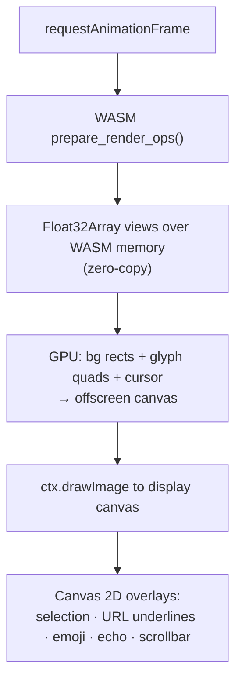
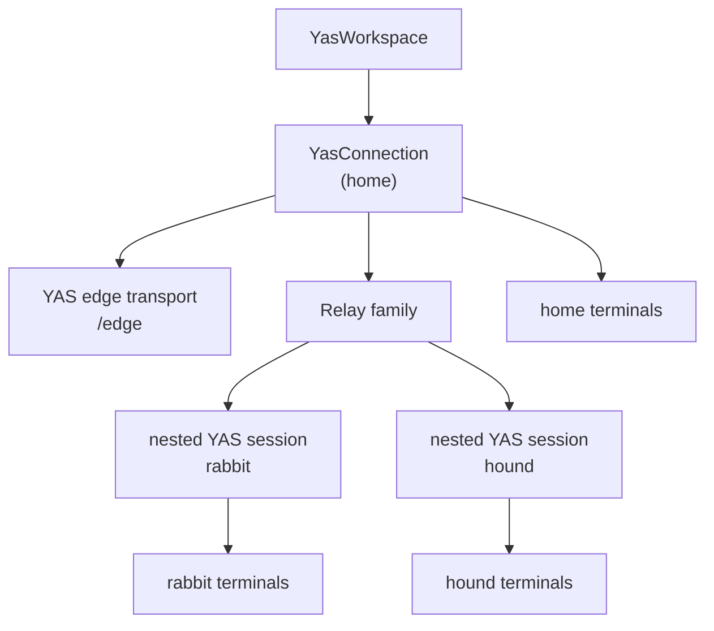

# Frontend

The browser side of YAS consists of a TypeScript native YAS session
(`@yas-run/core`), a Rust WASM renderer (`yas-browser`), and GPU backends
(WebGPU with WebGL2 and Canvas 2D fallbacks). TypeScript negotiates families,
validates native frames, and owns workspace and input state. WASM consumes a
private renderer snapshot and produces GPU-ready vertex data.

Each connected App owns its home connection and workspace. Component cleanup
closes and disposes the connection, including ping timers, renderer
subscriptions, nested Relay sessions, and their terminal and surface views.
The regular app and full-control shares on `yas.run/s` use the same
`ConnectedWorkspace` shell: workspace manager, durable tabs and layouts, and
home-server Relay remotes. Embedders select it with `mountYasWorkspace`'s
`home` option and a durable browser device ID. Read-only shares and fixed
`connections` embeds use local layout storage without workspace-session
management. Development source changes require a manual page reload.

Pane content is owned by surviving leaf identity outside the recursive layout.
Structural slots adopt the existing pane DOM when adding a first sibling,
nesting or collapsing splits, changing container kinds, or moving between tiled
and floating layouts. These edits retain terminal and surface canvases, input
state, and stream subscriptions, including the last picture of an idle Wayland
app. Only removing a leaf disposes its content; geometry and visibility still
update its size claim normally. Frozen leaves restored from backend snapshots
keep their original identity outside the mutable pane-prop store.

Transient disconnects retain the last terminal and surface catalogues, pane
assignments, and mounted canvases while the status indicator shows recovery.
Wire subscriptions and decoders are released; complete catalogues after
reconnect reconcile actual additions and removals. Revision-zero invalidations
are not empty server snapshots. Relay routes and product connections also stay
in place during retries, so a home-link interruption does not rebuild every
remote workspace.

On iOS/iPadOS, Safari and installed apps share a fixed opaque top strip to
suppress the system scroll-edge blur. It follows the palette, sits above
workspace overlays, and is at least 11 CSS pixels tall: WebKit samples a 2px
band 4px from the edge and ignores background colours on boxes at most 10px
tall. Both the root and the keyboard-pinned workspace reserve the strip's
safe-area inset so it never covers the tabs.

## Render pipeline overview

```mermaid
graph LR
    T["WebSocket / WebTransport / WebRTC"] --> NATIVE["@yas-run/core\nnative YAS session"]
    NATIVE -->|validate + apply\nterminal-grid/1| GRID["semantic terminal grid"]
    GRID -->|private compressed\nrenderer snapshot| WASM["yas-browser\n(WASM)"]
    WASM -->|vertex buffers\n(zero-copy)| GL["GPU renderer\n(WebGPU / WebGL2)"]
    GL -->|bg rects + glyphs| OC["offscreen canvas"]
    OC -->|drawImage| DC["display canvas"]
    DC -->|2D overlays| OUT["screen"]
```

## WASM runtime (`yas-browser`)

`yas-browser` compiles to `wasm32-unknown-unknown`. `@yas-run/core` first
decodes and applies the negotiated native `yas.terminal.grid/1` logical frame,
including its sequence and base-state rules. It then calls
`encodeBrowserTerminalGrid()` to serialize one complete semantic grid through
the private JS-to-WASM renderer boundary. The WASM `TerminalState` accepts that
LZ4-compressed snapshot through `feed_compressed()`; no YAS frame, family ID,
resource handle, or retired directional message tag enters the renderer codec.

When `prepare_render_ops()` is called for a render pass:

1. Iterates all cells in the grid.
2. Resolves foreground/background colors through the current palette (indexed colors, default colors, and bold/dim modifiers).
3. Coalesces adjacent cells with identical background color into merged rectangle operations.
4. For each cell with visible content, creates a `GlyphKey` (UTF-8 bytes + bold/italic/underline/wide flags), ensures the glyph exists in the atlas, and emits 6 vertices (2 triangles) with atlas texture coordinates.
5. Exposes vertex buffers to JavaScript via zero-copy WASM linear memory pointers (`bg_verts_ptr/len`, `glyph_verts_ptr/len`).

## Glyph atlas

The atlas is a **Canvas 2D `HTMLCanvasElement`**, not a GPU texture. It uses row-based bin packing to allocate glyph slots.

When a new glyph is needed:

1. A slot is allocated in the atlas canvas (power-of-two size, 2048–8192 px).
2. The Canvas 2D context sets font style (`"bold italic Npx family"`) and calls `fillText()` to render the codepoint in white.
3. Underlines are drawn with `ctx.stroke()` when the underline attribute is set.
4. The slot coordinates are cached in an `FxHashMap<GlyphKey, GlyphSlot>`.

The atlas canvas is uploaded to a WebGL texture once per frame (skipped if unchanged). The GL shader tints white glyphs with the per-vertex foreground color; color glyphs (emoji) pass through untinted.

## GPU renderer

The browser renderer has three backends, tried in order:

1. **WebGPU** — preferred when available (Chrome 113+, Edge 113+, Firefox Nightly). Async initialisation via `navigator.gpu.requestAdapter()`.
2. **WebGL2** — synchronous fallback, used while the WebGPU probe is in-flight or if WebGPU is unavailable.
3. **Canvas 2D** — software fallback when neither GPU API is available (e.g. headless environments).

All three implement the same `GlRenderer` interface and consume the same vertex buffers produced by the WASM module. `TerminalStore` kicks off the WebGPU probe eagerly in its constructor and transparently promotes the renderer once the probe resolves; frames rendered before that use the WebGL2 fallback.

### WebGPU renderer

Two WGSL render pipelines:

**RECT pipeline** — colored rectangles for cell backgrounds and the cursor.

- Vertex layout: `pos` (float32x2), `color` (float32x4) — 24-byte stride.
- Single draw call per frame (no batching needed; vertex buffer grows on demand).

**GLYPH pipeline** — textured atlas quads with per-vertex coloring.

- Vertex layout: `pos` (float32x2), `uv` (float32x2), `color` (float32x4) — 32-byte stride.
- Fragment shader uses the same gray-detection tinting as WebGL2 (grayscale → tinted, color → passthrough).
- Atlas uploaded via `copyExternalImageToTexture` with premultiplied alpha.

Both pipelines use premultiplied-alpha blending (`src: one, dst: one-minus-src-alpha`).

### WebGL2 renderer

Two shader programs handle all drawing:

**RECT shader** — colored rectangles for cell backgrounds and the cursor.

- Vertex attributes: `position` (vec2), `color` (vec4).
- Uses premultiplied alpha blending.

**GLYPH shader** — textured quads from the atlas.

- Vertex attributes: `position` (vec2), `uv` (vec2), `color` (vec4).
- Fragment shader: grayscale glyphs are tinted with the vertex color; color glyphs (emoji) render directly.

Both programs batch up to 65,532 vertices per draw call.

### Render loop (`YasTerminalSurface`)

Demand-driven via `requestAnimationFrame`:



Terminal panes publish their first nonzero container measurement immediately.
Unmeasured or hidden boxes never submit a provisional 1×1 grid, and reconnect
resends wait until the pane has a valid measurement.

## Input handling

### Keyboard

Input is captured via a hidden `<textarea>` element. `keyToBytes()` converts `KeyboardEvent` to terminal escape sequences:

| Key             | Sequence                                                          |
| --------------- | ----------------------------------------------------------------- |
| Ctrl+letter     | Control code (e.g. Ctrl+C → `0x03`)                               |
| Arrow keys      | `\x1b[A`–`\x1b[D` (normal) or `\x1bOA`–`\x1bOD` (app cursor mode) |
| Function keys   | `\x1b[15~`–`\x1b[24~`                                             |
| Modifier combos | `\x1b[1;{mod}X` format                                            |
| Alt+key         | `\x1b` prefix                                                     |

Enter sends `\r`; Ctrl+Enter sends `\x1b[13;5u` (CSI-u), including when Ctrl
is armed in the mobile toolbar. Additional modifiers are retained in the
CSI-u modifier parameter. Applications can bind the two chords separately.
Plain Alt+Enter continues to send `\x1b\r`.

Applications can enable the [Kitty keyboard protocol](https://sw.kovidgoyal.net/kitty/keyboard-protocol/)
with CSI `>flags u`, update it with CSI `=flags;mode u`, query with CSI `?u`,
and restore it with CSI `<count u`. YAS maintains separate stacks for the
normal and alternate screens and resets them on RIS. Keyboard flags travel
with terminal grid state, including mode-only deltas and scrollback views.

All five progressive enhancement flags are supported: disambiguation,
repeat/release events, alternate key identities, all-key reporting, and
associated text. Modified Enter, Tab, Backspace, Escape, letters, navigation,
function, keypad, media, and modifier keys retain their identities. Ctrl+I,
Ctrl+M, and Ctrl+[ become distinct from Tab, Enter, and Escape. Key releases
are sent only for forwarded presses; blur releases held keys. Enhanced mode
forwards Shift+PageUp/PageDown/Home/End to the application.

Browser layout metadata supplies alternate identities when available; missing
metadata is omitted. Browser and OS shortcuts can intercept keys before YAS
receives them. Ctrl+Shift+V remains paste; Ctrl+V preserves image clipboard
forwarding and emits the negotiated key sequence after the clipboard is ready.
Paste remains text, with bracketed paste when enabled. IME and soft-keyboard
commits use associated text in all-key mode when requested; otherwise YAS
encodes the committed characters. Mobile modifier buttons use the same encoder.

When a Wayland app owns the clipboard, Cmd+V and Ctrl+Shift+V in a terminal pane
on the same connection read that selection directly, including a pending copy.
They do not require host clipboard export or browser clipboard-read permission;
Cmd+V works even when an empty host clipboard produces no browser paste event.
For browser-owned clipboard contents, Cmd+V keeps using the native paste event.

The native viewer requests disambiguation and key events from supporting host
terminals, enabling all-key reporting only when the focused child requests it.
Crossterm does not expose layout alternatives or associated-text fields, so
native forwarding omits unavailable metadata. Hosts without enhanced keyboard
support cannot recover distinctions already lost in their input bytes.
`yas terminal attach` mirrors the child's negotiated flags directly to the
host and forwards its raw sequences, including layout and text metadata.
Ctrl+] still detaches in enhanced mode; exiting restores the host's keyboard
mode. No negotiation is forced on legacy child programs.

### Mouse

Mouse events use the native Terminal `MOUSE` Event. The server generates the
correct escape sequence based on the PTY's current mouse mode and encoding
(X10, VT200, SGR, pixel). Client-side text selection (word/line granularity,
drag) and clipboard copy are handled independently of terminal mouse mode —
the browser intercepts the selection before it reaches the terminal emulator.

Pane dividers, dock resizing, and floating-window drags keep the initiating
pointer ID for the whole gesture. A connected mouse or a second finger cannot
move or end a touch drag. Cancellation, lost capture, window blur, and unmount
release the drag listeners.

Pane movement grips and sidebar drag sources use the pointer-driven drag
bridge for iPad mouse and trackpad input as well as touch. This keeps pane
placement, parking, and dragging sidebar cards into the layout working when
WebKit does not start a native drag. iPad mouse drags start on movement in any
direction; touch keeps its leftward swipe/hold on parked cards and long press
on scrollable rows. Stationary mouse presses remain clicks. Desktop mouse and
pen input retain native dragging. Escape or window blur cancels the bridge
without dropping. The bridge disables native dragging for the whole press,
including a stationary touch hold, and restores it on release or cancel.
Dedicated grips also cancel touch defaults to preserve pane focus.
Only one pointer can own the bridge at a time.

Chrome buttons (`TapButton`), main-menu entries, and left-dock headers/list
rows (`TapArea`)
activate inside `touchend`, through `HTMLElement.click()`, without waiting
for compatibility mouse events. Both share tap tracking and duplicate-click
suppression. Scrollable ancestors retain native swipes; movement, multitouch,
cancellation, context menus, and drag starts cancel activation. Nested controls
own their taps so a secondary action does not also activate its containing row.

On iPadOS, manual and Wayland keyboard requests share a focus handoff through
a temporary textarea when the pane's input is already focused. Viewport
occlusion completes the handoff; the timeout fallback yields through rendering
before returning focus, so a busy video stream can deliver its delayed viewport
update first. Repeated taps retain the pending handoff. Hiding, replacement,
and unmount cancel its timers and remove its host. Focus transfers prevent
browser scrolling.

Tray icons keep their DOM identity across connection snapshots so updates
cannot interrupt a tap or hold. Touch activation opens an advertised menu
directly, including when no pointer event or compatibility click arrives;
mouse clicks retain the application's primary action. The same behavior
applies to icons in the tray overflow popup. Status, tray, and notification
popovers dismiss from either an outside `pointerdown` or native `touchstart`,
so iPadOS does not depend on synthesizing a compatibility pointer event.

When the software keyboard pans the visual viewport, the workspace follows
with fixed `top`/`height` positioning. It stays untransformed so terminal and
surface IME targets retain viewport coordinates and remain aligned with their
rendered cursors; adding the viewport offset twice puts the hidden input
behind the keyboard and triggers another browser reveal pan.

Branches and Commit Log expand automatically for Git roots and fold outside
repositories. Manual Git-section toggles last only for the current root and
repository availability; they do not become global saved collapse preferences.
Files and Problems retain their saved choices. An open left dock keeps the
shared IDE session available for repository discovery even with every section
folded; folded panels still release their tree, log, worktree, and LSP leases.

Explorer tree and changed-file rows use the terminal's `measureCell` height
for row spacing and text line boxes. Smaller change labels are measured at
their own font size. Metrics refresh when the selected font/size changes, a
font finishes loading, or the viewport resizes. Ellipsis still clips long
names horizontally without cutting off descenders.

### Terminal touch scrolling

Shell scrollback uses a native scroll surface for touch panning and momentum.
Keyboard-driven height changes preserve the current scrollback anchor even
when WebKit delivers the scroll event before ResizeObserver. The spacer is
resized before interpreting further gestures. Cursor, selection, and paging
use the displayed server grid while a requested resize is pending. Panes and
previews sharing a terminal restore their own glyph metrics before painting,
so text stays aligned with the cursor and scrollbar after layout changes.
Scroll replies only correct the latest request in the same open view; older
replies cannot rewind an ongoing swipe. Typing discards pending corrections
as it returns to live output. The scrollbar follows the rendered PTY grid,
which can be smaller than the pane when another client shares the terminal,
and keeps its width and minimum thumb height in CSS pixels on dense displays.
Mouse-reporting terminal applications receive wheel reports instead: the
touch handler cancels every move from the first event, including movement
shorter than one row, so WebKit cannot begin native scrolling in parallel.
A second finger cancels the terminal gesture until a fresh touch starts.

### Copy

On macOS, surface `Cmd+C`/`Cmd+X` is translated to the Linux application's
`Ctrl+C`/`Ctrl+X`. The same trusted keydown reserves a host clipboard write
with a promised `ClipboardItem`; its text resolves after the application
publishes the resulting Wayland selection. This ordering keeps Chromium and
Brave's transient clipboard authorization while allowing for the server round
trip.

Wayland-owned selections are published in the native Selection catalogue with
their full MIME offer. Content remains in the owning application and is fetched
through Selection `GET` only when a terminal, editor, or host clipboard bridge
requests a representation. If the browser rejects the host write, the
catalogued selection remains available inside YAS.

Terminal selections outside the rendered viewport require a server
`COPY_RANGE` request. They reserve the same promised `ClipboardItem` during the
initiating gesture, then resolve it when the range arrives, so browser user
activation does not expire mid-copy. OSC 52 writes from PTY output are ignored:
terminal output is untrusted and cannot asynchronously replace the user's host
or Wayland clipboard.

Host clipboard authority is page-global. One epoch is advanced by DOM copy/cut,
window blur, every successful programmatic UI copy, and every completed
Wayland-to-host mirror. Each connection records the epoch at which its current
Selection revision arrived, so a host copy in one pane or connection supersedes
stale Wayland owners in every other connection. A completed mirror attributes
that new epoch to its source connection, preserving its richer multi-MIME owner
for direct local pastes.

### Paste

Pasting into a Wayland surface is not a keystroke, it is a keystroke with a
prerequisite: the app reads the selection the instant it sees Ctrl+V, so
`YasSurfaceCanvas` holds the V press back until the clipboard has been stored
through the native Selection family and its SET result has succeeded, then
releases press, V release and Ctrl release in order. This result barrier matters
for values above 32 KiB, whose hash, upload Transfer, close, and SET_COMMIT are
asynchronous. Clipboard reads and focus loss settle the chord; a failed read,
failed SET, or empty host clipboard gives up rather than delivering V with a
stale selection behind it. A
10-second safety timer also releases deferred modifiers if a browser permission
promise never settles. PRIMARY offers use the same commit barrier before the
middle-button press.

A paste event and async clipboard reads can supply the content, because neither
path is reliable alone. `navigator.clipboard.readText()` may be denied without
permission in Chromium and Brave, while browsers may not fire `paste` at a
focused non-editable canvas (hence the focus shuffle through the hidden
textarea).
`clipboardImage()` takes the best `image/*` item on the event and forwards its
bytes under their own MIME type, preferring PNG. On a Ctrl chord that does not
produce a paste event (notably Ctrl+V on macOS), `navigator.clipboard.read()` is
also started synchronously in the keydown handler so it retains the event's
transient user activation. Its image result is only consumed after
`readText()` returns empty or is denied, preserving text preference.

An image only wins when the clipboard has no plain text: rich sources put
several representations on one clipboard, and the text is what pasting a
spreadsheet range is expected to produce. This browser action stores the one
chosen representation; the Selection family itself can describe multiple
items and MIME representations.

An image over the browser's 8 MiB paste limit — or a blob that will not read —
takes the stand-down path rather than the flush's: warn, stand the chord down,
no V. Values within that browser limit use Selection's bounded inline or
Transfer delivery and are never truncated. Pressing V after refusing the new
value would paste whatever the selection held _before_, which is not what was
copied. An empty host clipboard also stands down. A known live Wayland owner
still takes the direct path without importing the browser clipboard — copy in
one surface, paste into another, browser never in the middle.
The copy/cut keydown marks that ownership locally before the Selection snapshot
can complete its server round trip, so an immediate switch to another surface
cannot import a stale host clipboard in the gap.

Every listener on the event's path (canvas, hidden textarea, and the
document-level capture listener that catches what the canvas misses) runs the
same handler, so the first to see an event marks it; without that a screenshot
would go out once per listener.

Terminal paste observes the same clipboard authority. While a Wayland client
owns the selection, `YasTerminalSurface` takes text from the connection's
Selection catalogue instead of `navigator.clipboard`, then uses Selection `GET`
to fetch it lazily from the compositor. This keeps surface-to-terminal copy
working when the browser rejects the host-clipboard write. A live Wayland
selection with no supported UTF-8 text representation does not fall through to
stale host clipboard text. Image paste waits for its Selection SET result before
sending the terminal's paste-trigger byte.

### Hyperlinks

Two sources feed one code path in `YasTerminalSurface`:

- **OSC 8** — the application declared the target explicitly. `Terminal.link_at()` resolves the URI at a cell and `Terminal.link_segments()` returns the link's full extent as `[row, startCol, endCol]` triples, one per screen row. A link that runs past the right edge continues on the next row, so a wrapped link yields several triples and is underlined as one continuous span.
- **Regex fallback** — `https?://…` matched against the visible row text, for applications that emit no OSC 8. Single-row only; its target is its own text.

OSC 8 wins where both apply. Because it lets the target differ from the displayed text, every target is classified by `assessUrl()` (`js/core/src/urlSecurity.ts`) before it can be opened:

| Verdict   | Applies to                                                                         | Behaviour                                 |
| --------- | ---------------------------------------------------------------------------------- | ----------------------------------------- |
| `allow`   | `http`, `https`, `mailto` with nothing deceptive                                   | opens directly                            |
| `confirm` | custom schemes, local `file:`, embedded credentials, punycode/non-ASCII hosts      | prompts, showing the real target          |
| `deny`    | `javascript:`/`data:`/`blob:`/`view-source:`…, remote `file://`, hidden characters | refused; drawn dashed red, not underlined |

The hidden-character check runs _before_ the scheme check, since a leading control byte is exactly what slips a dangerous scheme past a check built on `new URL()`. Scheme extraction never uses `URL` for the same reason. `assessment.display` escapes invisible and text-reordering codepoints to `<U+XXXX>` — render that, never `assessment.raw`.

Embedders hook `surface.onLinkHover()` for a preview and `surface.setLinkActivateHandler()` to replace the default `window.confirm` with an in-app dialog; a custom handler receives the assessment and must honour its verdict.

### Predicted echo

When the PTY is in echo + canonical mode (mode bits 9 and 10), the browser shows typed characters immediately before the server confirms them. This makes typing feel instantaneous over high-latency connections. Predicted characters are displayed with a distinct style and replaced with server-confirmed output on receipt.

## Workspace and connection model



`YasWorkspace` manages the home connection and the nested native sessions
opened through its Relay catalogue. Each server has its own opaque handle
namespace; stable UI references pair the route identity with the server's
opaque handle.

When the page becomes visible or the network comes online, the UI bypasses
retry backoff only for a disconnected or failed home transport. Connected
transports and in-progress handshakes stay intact, preserving background
audio and nested Relay sessions when returning to the app.

Foreground events also restore keyboard focus if the browser lost it. The
previous control is preferred, followed by the current pane's input and a
non-editable workspace fallback, so shortcuts remain reachable with no pane
open. The fallback yields to a pane input when one becomes available. Removing
a focused control also restores pane focus while the page stays active, unless
an overlay owns the keyboard or another control has taken focus. Explicitly
blurring an input that remains mounted does not trigger this recovery, so the
mobile keyboard can still be dismissed. The keyboard prefix stays armed across
blur and backgrounding until the next key chooses an action or cancels it.
Surface arrivals and activation requests preserve open menus and their input;
explicit selections dismiss the menu when chosen, before asynchronous work.

The durable UI around those live processes is a **workspace**. The
home server stores each session in YAS KV; it contains the selected remote
route names, pane layout and stable pane assignments, focus, and semantic
panel state. Attaching is browser-local and does not keep a stale server-side
presence bit. Shared browser URLs use `#workspace=<id>`; legacy
`#session=<id>` links remain accepted. Layout and
panel mutations use bounded CAS retries against the backend record. See
[Backend workspaces](design/workspace-sessions.md) for the record and
lifecycle contract.

## Surface video decoding

GUI app surfaces (see [server.md § Headless Wayland compositor](server.md#headless-wayland-compositor)) are decoded in the browser via the **WebCodecs `VideoDecoder` API**:

- Codec is selected by native Surface view negotiation and carried as the `codec_version` on each Surface `FRAME`; frame flags identify keyframes, codec configuration, and discardable frames.
- `optimizeForLatency: true` is set on the decoder to minimize decode delay.
- Surface frame credit advances from the WebCodecs output callback, not from
  `decode()`. The reported decoder depth counts submitted chunks still waiting
  for output, so a platform decoder cannot hide a deep internal queue by merely
  accepting more input. Intentionally dropped and failed chunks are consumed in
  sequence, and cumulative feedback never jumps over an earlier unfinished
  frame.
- Decoder configurations include the current encoded dimensions and square-pixel display aspect for H.264 and AV1, including after rotation and adaptive resolution changes. These come from the stream, not the pane or logical window, so Android hardware decoding does not start from Chromium's default 1280×720 size guess.
- Decoded `VideoFrame`s are rendered to a canvas by `YasSurfaceView` (React/Solid component).
- Surface canvases allocate decoded frame dimensions rather than the remote catalogue's native size. Failed 2D context allocations retry on the next frame; restored visible contexts repaint the cached frame, and restored backing contexts request a fresh keyframe. Teardown explicitly releases canvas pixel buffers instead of waiting for garbage collection.
- Closing the last mounted stream releases its decoder, queued frames, HDR frame, and backing canvas while retaining the surface catalogue. Decoder draining has a one-second deadline so a hung `flush()` cannot retain hardware resources indefinitely. A visible stream with a chunk still awaiting output after two seconds is retired and requests a keyframe, even when frame-credit backpressure has stopped further input. Recovery requests share a bounded retry budget; idle streams with no pending chunks are left alone, and callbacks from retired decoders cannot reset replacement streams.
- Shared surface sizing first expands each viewer's logical box by any zoom-out forced by the application's minimum size, then takes the tightest bound on each axis. A 360×780 pane facing a 500px minimum width can therefore offer 500×1083 logical pixels; another viewer can still limit the height. Committed minima travel separately from rendered geometry so repeated frames cannot inflate the window, and releasing a minimum restores the original bounds. Maximum hints remain enforced by the compositor. Stream pixels stay bounded by viewers' physical panes.
- Live canvases present each frame's logical extent at their own display scale and zoom, anchored top-left. During an in-flight resize, old frames retain that scale and are clipped by the pane until resized pixels arrive. Only committed application minima force uniform zoom-out; an oversized frame alone never does. Smaller frames are not enlarged. Geometry stays paired with the decoded frame through adaptive downscaling and queued presentation; new catalogue geometry cannot reinterpret an older frame. Streams stay bounded by the requested physical view size, with aspect-preserving server downscaling, even when the application minimum is larger.
- Surface views track browser DPI changes independently of pane resizing, so page zoom and moves between displays request the new Wayland scale even when the pane keeps the same physical dimensions.
- A live pane does not open its stream before its first nonzero measurement. YAS records that pane constraint first, sends the corresponding resize, and only then opens the view, so encoder selection starts at the real display extent instead of a native-size or tiny provisional extent. The canvas uses each frame's logical extent at the local display DPI. Servers without per-frame logical metadata fall back to the latest catalogue geometry.
- The sidebar waits for saved pane assignments to resolve before treating surfaces or terminals as parked. An intermediate empty layout during reload must not open thumbnail streams that the restored main panes would inherit from the shared frame cache.
- Mouse and keyboard events from the surface canvas use native Surface `KEY`, `TEXT`, `POINTER`, and `AXIS` Events.
- Surface key events carry the browser's observed Caps Lock state. The compositor applies that snapshot directly, so reloads, focus changes, and other viewers cannot leave case dependent on a browser's remembered toggle history. Committed text already includes the browser's case selection; synthesis temporarily clears Shift and Caps Lock and restores them before the next raw key.
- Mirrored pointer overlays disappear on leave or ownership handoff. The browser also honors each remote-input expiry, independently per surface and input kind, so stale cursors cannot persist and pointer cleanup preserves active touch contacts.
- Surface cursor metadata drives the canvas CSS cursor. Withdrawing that metadata, removing a surface, or resetting the store restores the default cursor on mounted canvases. Motion within the same surface preserves the application's cursor visibility, including video idle hides and pointer-lock cursors; it does not synthesize Wayland leave/re-enter or flash a local arrow. The browser provides immediate local recovery only when taking pointer ownership with cached hidden state, such as after a guest reload or viewer handoff. A non-empty mirrored pointer proves another viewer took the shared Wayland pointer, so the prior viewer drops its local ownership claim. Real pointer entries and same-surface viewer handoffs produce a Wayland leave/re-enter, giving the new owner a fresh cursor serial and invalidating late cursor requests from the old position. On each new entry, the compositor resets any cached cursor to the default until the application selects a replacement, so custom artwork and named shapes cannot stay stuck from the previous entry. Cursor authority follows the client on the seat, so a retained cursor-shape device can restore the pointer after Chromium replaces its `wl_pointer` on a seat capability update. Requests still require that client to hold pointer focus and use its latest enter serial.
- Mounted surface canvases follow connection instances as well as IDs. When Relay replaces a connection under the same ID, they release the old view and rebind cursor, frame, and input state to the replacement. A browser-focused surface reasserts remote keyboard focus once its display box and replacement catalogue are ready, without requiring another tap or stealing focus from chrome. Server-side view removal also retires its pointer focus, covering disconnects that cannot send a pointer leave.
- A zero-size pane or hidden browser page withdraws its surface size claim and cancels queued resizes. Showing it again reclaims its measured box, even if the dimensions are unchanged. Window resize events remeasure the box independently of changes in display DPI.
- Native file drags announce planned screenshot filenames during hover. Selection creates private files for that drag, exposes their URI list to the destination, and fills them only after every DROP payload has validated. No prior FS upload is required. File offers expose URI and binary representations rather than making Chromium wait for unavailable image bytes during hover; this supports screenshot-thumbnail drops into Electron apps such as Legcord. Dropped files remain available until the session closes.
- Surface views accept `touchMode="pointer" | "direct"`. Direct mode is the default and forwards each event's contact changes as Surface `TOUCH` for native Wayland multitouch. Pointer mode is the explicit fallback and maps touch to tap, finger scroll, long-press right-click, and hold-drag. The UI exposes this as **Media → Touch input**.
- Surface `OPEN_VIEW`/`CONFIGURE_VIEW` explicitly opt into the seat's touch capability through `VIEW_DIRECT_TOUCH_EXTENSION`. Browser viewers enable it only when `navigator.maxTouchPoints > 0` and a mounted canvas uses direct mode. Mouse-only viewers and pointer-mode touch viewers do not advertise a touchscreen: a false touch capability makes sites such as Apple's video player select touch controls that fail to restore the cursor on mouse movement. Disabling a view's capability cancels its contacts; the seat retains touch while another opted-in view remains.
- Hardware-keyboard Shift+Space is forwarded as a native key chord, preserving Shift for shortcuts such as scrolling up in a remote browser. Other printable keys use browser-resolved text to preserve the host keyboard layout.
- Enter preserves held modifiers even when the browser omits its physical key code, so Wayland applications receive Ctrl+Enter distinctly from Enter.
- Backspace and Delete fall back to their logical key when the browser omits or cannot identify the physical code (notably iPadOS forward Delete). Modified deletion chords and forward Delete retain hardware press/release handling. Unmodified iPad Backspace edits the capture field natively so held-key repeat continues; deletions reach the app through input events. Deletable filler remains behind the recent text, and its delayed refill preserves that text and waits beyond the initial long-press delay.
- Losing page focus or hiding the PWA cancels its active touch sequence. Closing a native surface view also releases its server-side touch lock and cancels its compositor contacts, even when the browser could not send a final release. Other views remain able to touch after reloads and view replacement.
- Fresh Wayland text-input enables may open the mobile on-screen keyboard by default. Users can opt out with **Media → On-screen keyboard → Manual only**, leaving the status-bar keyboard control available. The native catalogue carries a request revision across coalesced caret updates; viewers consume each new revision once and suppress historical requests in their initial snapshot. Removing text-input metadata delivers a disable. Requests that arrive during a touch can retry at release with browser user activation.
- Surface capture fields follow Wayland completion, spellcheck, content purpose, and capitalization hints, including writing suggestions. Android and iPadOS retain a bounded mirror of recent committed text so keyboard corrections and accepted suggestions replace that text instead of appending a second word. iPad printable keys edit the capture field natively to provide QuickType with context. When Wayland content hints arrive after the keyboard has moved from a terminal to a surface, iPadOS refreshes the capture field’s keyboard traits; caret-only updates preserve the existing input session. Pointer actions, forwarded command keys, focus changes, and remote text-field changes discard the mirror when its caret context is no longer valid.
- Wayland caret rectangles position the hidden IME input over the application's text, anchoring host candidate windows there. The compositor acknowledges text-input commits so clients can report their caret before the first composition, and preserves the active preedit across those acknowledgements. The server preserves zero-width carets with a positive line height by publishing a 1-pixel-wide rectangle. Losing focus invalidates the browser's cached placement, so refocusing restores the caret immediately even when the application is idle. Capture inputs disable pointer events, matching terminals. During composition, the capture field fits the unwrapped text and uses the caret's line height, keeping the character bounds used by the host IME inside the field.

### Presentation scheduling

`SurfaceStore` does not draw a frame the moment it decodes. Each surface has a presenter that paints at vsync (`requestAnimationFrame`) in one of two modes:

- **Newest-wins** while the surface is idle or interactive: paint the freshest frame, close the rest. Minimum time-to-pixel, because a repaint there is a response to input and any hold reads as lag.
- **PTS-scheduled** once the surface has delivered `SMOOTHING_ENGAGE_FRAMES` (8) consecutive frames without a gap: each frame is painted on the refresh its capture-time PTS maps to, and frames not yet due stay queued.

The PTS is the Surface `FRAME.presentation_ns` value, or `capture_ns` when no
distinct presentation time is supplied. It is stamped before encode and
transport, so replaying against it cancels the jitter both add. Encode runs
fire-and-forget off the server's tick loop, so per-frame encode latency varies;
without scheduling that variance lands directly on screen as an uneven 2-0-1-2
cadence at a nominally perfect frame rate.

Presentation uses the late end of the `arrival − pts` offsets seen over the last `OFFSET_WINDOW_MS` (1 s) of stream, ignoring one isolated high sample. The low `FAST_QUANTILE` (p2), plus its matching decoder delay, is the fast-path baseline. Added headroom is hard-capped at the smaller of one source-frame interval and 8 ms; a same-host path identified by a protocol RTT of at most 2 ms bypasses scheduling entirely.

Both ends come from **one** distribution, which is what makes this robust in both directions without special-case rules. A burst frame — captured later but shipped immediately behind its predecessor, so genuinely faster in transit — is a low outlier; a frame delayed by a stall is a high outlier; a quantile ignores each for the same reason. An earlier design tracked the baseline as a running minimum with an upward leak and a clamped downward step, which needed two constants and still froze the surface for the length of any abrupt path improvement, because the baseline could only descend a few ms per frame while the true offset had already dropped.

A quantile rather than a peak-tracking average, because a peak tracker spends the entire latency budget on outliers it cannot cover anyway: one frame 200 ms late took the old estimator from 0 to 100 in a single sample, pinned the margin at the ceiling, and then decayed at 0.98/frame — about 55 frames, nearly a second at 60 Hz, of maximum latency bought by one event. The quantile sizes to the jitter that recurs and lets the tail fall through to skip-to-newest, which is the correct handling for an outlier regardless. The window is expressed in time, not frames, so the horizon is the same at 24 and 240 fps.

The presentation offset grows to a measured target immediately and sheds excess headroom by a small fraction of one source interval per frame. Moving it _is_ a latency change — every future due time shifts with it — so the downward slew avoids injecting a second visible discontinuity after the path recovers.

A **PTS** gap over `STREAM_GAP_MS` (250 ms), a backwards PTS (the server's u32 ms counter wrapping), or the tab going hidden all reset the presenter to newest-wins. A frame without a finite PTS never engages scheduling.

The reset keys on capture time, never on arrival time, because the two mean
opposite things. A source that went idle stops advancing PTS, and its next frame
answers input — that one must paint immediately. A stalled transport kept
producing all along; those frames retain continuous PTS even when they arrive
late. The reliable path preserves codec order. When an eligible discardable
Surface frame uses WebTransport or WebRTC datagrams, its explicit sequence and
base sequence drive loss and reordering recovery; keyframes and codec
configuration remain on the reliable path.

The queue depth is derived, not fixed: the frames a margin legitimately spans is `margin / frame_interval`, plus two frames of scheduling slack, and the frame interval is learned from PTS deltas rather than assumed. With the one-frame headroom ceiling this remains small even at 240 Hz. Learning the interval from PTS also means the depth follows the rate the encoder _actually_ sustains, not the rate that was requested.

**Measured on loopback** (`yas surface record --timing`, mpv at 1280×720 into a local server, 471 frames): the capture clock is a clean grid — PTS deltas mean 16.69 ms, p95 19 ms, one 38 ms outlier — and delivery jitter is tiny, p95 − p2 of **2.5 ms**. That is below half a refresh, so on a local link the scheduler cannot hold a frame and is a no-op by construction. Its value is entirely on links with real jitter, which is also the only place it carries risk. The recorder acknowledges each native Surface frame immediately and does not configure a display-rate ceiling, so these numbers are capture + encode + transport jitter — exactly the input the margin absorbs — and say nothing about pacing under backlog.

**Limits.** Jitter beyond one source frame is deliberately not absorbed. Hiding
a 70 ms reliable-stream recovery requires imposing roughly 70 ms of permanent
input latency, and still fails on the next larger outlier. The presenter instead
skips stale decoded frames after they arrive. Reliable transport loss can still
stall newer encoded frames until retransmission. Optional datagrams avoid that
head-of-line delay only for frames the Surface family marks discardable; their
sequence/base metadata and keyframe recovery prevent unordered decoder
submission from corrupting inter-frame references. The refresh period is
learned from plausible rAF deltas; longer intervals are treated as
main-thread/background stalls rather than display cadence.

Audio output treats duplicated or reordered discardable Media frames as loss.
A newer frame releases any incomplete older assembly; late fragments do not
end the subscription. Malformed optional datagrams are dropped while invalid
reliable frames retain strict validation. The viewer renews audio credit over
the reliable lane after 500 ms without an ACK, using its latest consumed
sequence. This restarts audio even when an entire window of datagrams was
lost and no frame callback remains to grant credit. Closing audio stops the
renewal timer.

## Font serving

The home server owns the native YAS Font family. `yas-fonts` discovers every
face in configured system directories, extracts its family/style/weight,
monospace and variable/color metadata, metrics, OS/2 embedding policy, byte
length, and BLAKE3 content hash. Font export is enabled by default;
`YAS_FONT_EXPORT=0` disables it. LIST and DESCRIBE expose only exportable faces
without filesystem paths; FETCH returns their exact standalone bytes. Faces
whose embedding bits forbid export, and families with no exportable faces,
are omitted. Disabling export leaves the catalogue empty. The edge does not
inspect or serve fonts. The browser picker also filters out non-fetchable
families advertised by older servers.

The browser watches the selected server's Font catalogue, describes only the
families it needs, and creates `FontFace` objects from fetched bytes. It derives
the terminal advance ratio from the server-provided metrics. Face bytes are
cached globally in IndexedDB under their content hash only after the browser
recomputes and verifies that hash, so identical faces can be reused safely
across home and relayed servers. Catalogue and face requests are tied to the
active YAS session; a stale response cannot replace the selected server's
fonts. The loader waits for the IndexedDB write to commit before reporting a
newly fetched face ready, so a reload cannot interrupt that write. Cache
failures fall back to fetching and displaying the face.

Font-panel rows use the shared touch buttons: a tap previews a family, Apply
persists the choice, and swiping the list scrolls without selecting a row.

There are no HTTP font routes. Font metadata and bytes use only the native YAS
Font family and its negotiated limits and export policy.
