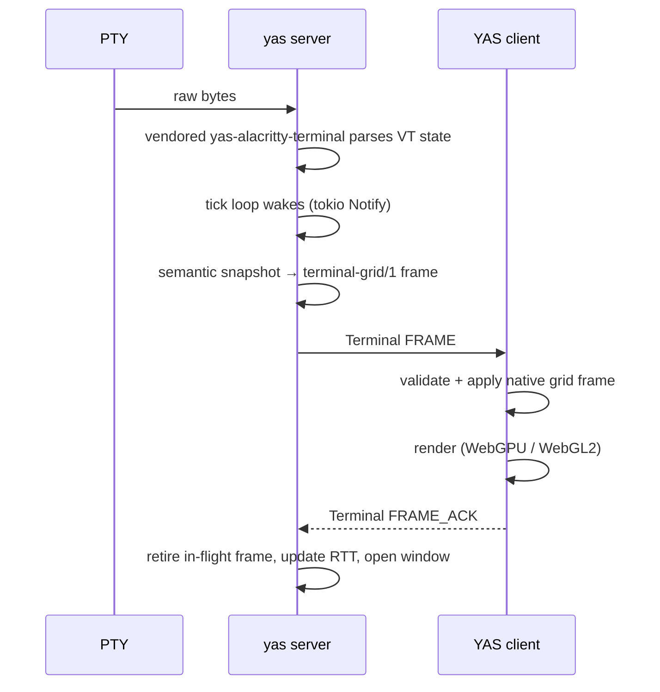
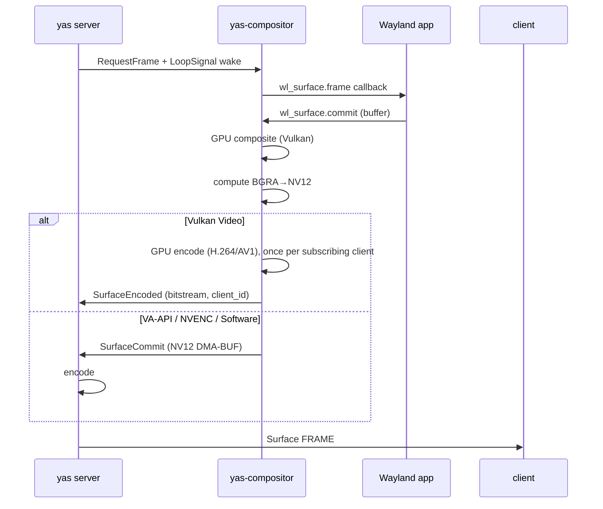
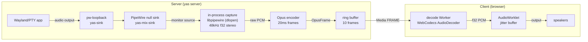

# Server Internals

`yas server` is a single async Rust binary (tokio runtime). It owns PTYs,
terminal state, and per-client frame scheduling. It has no CLI subcommands and
no RPC API beyond the native binary protocol described in
[design/yas.md](design/yas.md). Configuration is available through the flags in
`yas server --help` and their documented environment equivalents.

Native sessions use Core Ping on every transport, including WebSocket and
relayed streams. After ten seconds the server probes the peer; a valid reply
keeps the session alive and schedules the next probe. An unanswered probe
closes the session after another twenty seconds, releasing its views and size
claims. The deadline covers blocked writers and application handlers. Pings
preserve healthy idle sessions; browser component cleanup explicitly closes
connections that are no longer needed.

## Configuration

| Variable                             | Default                                                       | Purpose                                                                               |
| ------------------------------------ | ------------------------------------------------------------- | ------------------------------------------------------------------------------------- |
| `YAS_SOCK`                           | private runtime directory; see [transports.md](transports.md) | Exact native YAS socket override; automatic paths use an owner-only directory         |
| `YAS_SERVER_NAME`                    | `default`                                                     | Instance name (also `--name`); isolates socket, state, cache, and extension settings  |
| `YAS_REMOTES`                        | `~/.config/yas/yas.remotes`                                   | Only the file the one-time import reads; the live catalogue is the `remotes` KV key   |
| `YAS_RELAY`                          | `1`                                                           | `0` disables the native YAS Relay family                                              |
| `YAS_FONTS`                          | `1`                                                           | `0` disables the native YAS Font family                                               |
| `YAS_FONT_EXPORT`                    | enabled                                                       | `0` disables font export and empties the catalogue; OS/2 embedding restrictions apply |
| `YAS_EDGE`                           | unset                                                         | `1` serves the browser from this process (also `--edge`); needs a passphrase          |
| `YAS_SHARE`                          | unset                                                         | `1` publishes this server over WebRTC from this process (also `--share`)              |
| `YAS_EDGE_PASSPHRASE`                | `YAS_PASSPHRASE`                                              | The hosted edge's own passphrase                                                      |
| `YAS_SHARE_PASSPHRASE`               | `YAS_PASSPHRASE`                                              | The hosted share's own passphrase                                                     |
| `YAS_FONT_DIRS`                      | platform defaults                                             | Additional server-side font scan roots                                                |
| `SHELL`                              | `$SHELL` or `/bin/sh`                                         | Shell spawned for new PTYs                                                            |
| `YAS_SHELL_FLAGS`                    | `li` (Unix) / `` (Windows)                                    | Shell invocation flags                                                                |
| `YAS_SCROLLBACK`                     | `10000`                                                       | Scrollback buffer rows per PTY                                                        |
| `YAS_TERM_JOURNAL`                   | `1`                                                           | `0` disables the OSC 133 command journal capability                                   |
| `YAS_TERM_JOURNAL_MAX`               | `256`                                                         | Finished command records retained per PTY                                             |
| `YAS_TERM_JOURNAL_CMD_MAX`           | `4096`                                                        | Bytes of command-line text retained per record                                        |
| `YAS_TERM_OUTPUT_MAX`                | `1048576` (1 MiB)                                             | Server ceiling on Terminal `OUTPUT` and `WAIT` query delivery                         |
| `YAS_EVENTS_SIZE`                    | `1048576` (1 MiB)                                             | Process-wide binary event-ring capacity                                               |
| `YAS_EVENTS`                         | `default`                                                     | Fine-grained event activation selectors                                               |
| `YAS_EVENTS_FILE`                    | unset                                                         | Start a persistent server-side binary event stream                                    |
| `YAS_EVENTS_FILE_HISTORY`            | `1`                                                           | `0` excludes retained history from the startup file                                   |
| `YAS_EVENTS_FILE_APPEND`             | `0`                                                           | `1` appends the startup file instead of truncating                                    |
| `YAS_VAAPI_DEVICE`                   | `/dev/dri/renderD128`                                         | VA-API render node for surface encoding and camera decoding                           |
| `YAS_COMPOSITOR_DEVICE`              | CUDA GPU when NVENC is enabled                                | Vulkan compositor render node; otherwise `YAS_VAAPI_DEVICE`                           |
| `YAS_CUDA_DEVICE`                    | `0`                                                           | CUDA device ordinal for NVENC and NVDEC                                               |
| `YAS_FD_CHANNEL`                     | unset                                                         | fd-channel file descriptor                                                            |
| `YAS_EXPORT_SOCK`                    | unset                                                         | `1` exports the socket path as `YAS_SOCK` in spawned terminals (also `--export-sock`) |
| `YAS_INJECT_PATH`                    | unset                                                         | `1` appends the binary's dir to `PATH` in spawned terminals (also `--inject-path`)    |
| `YAS_SURFACE_ENCODERS`               | see encoder table                                             | Comma-separated encoder priority (also `--surface-encoders`)                          |
| `YAS_SURFACE_BANDWIDTH`              | `ultra`                                                       | Ceiling on video bandwidth (adaptation only goes cheaper)                             |
| `YAS_SURFACE_SPEED`                  | `realtime`                                                    | Encoder speed preset                                                                  |
| `YAS_MEDIA_CAMERA_CODECS`            | all                                                           | Camera formats viewers may send (also `--camera-codecs`)                              |
| `YAS_MEDIA_MICROPHONE_CODECS`        | all                                                           | Microphone formats viewers may send (also `--microphone-codecs`)                      |
| `YAS_MEDIA_CAMERA_DECODERS`          | `nvdec,vaapi,vulkan,software`                                 | Camera hardware priority with implicit software fallback                              |
| `YAS_MEDIA_CAMERA_VULKAN_DEVICE`     | unset                                                         | Optional Vulkan device index or name substring for camera decoding                    |
| `YAS_MAX_CONNECTIONS`                | `0` (unlimited)                                               | Reject client connections past this count                                             |
| `YAS_MAX_PTYS`                       | `0` (unlimited)                                               | Refuse `CREATE` past this many PTYs across all clients                                |
| `YAS_PROCESS`                        | `1`                                                           | `0` disables the native Process family                                                |
| `YAS_PROCESS_MAX_PER_CLIENT`         | `16`                                                          | Pending spawns, live watches, and unwatched owned processes per endpoint              |
| `YAS_PROCESS_MAX`                    | `64`                                                          | Process generations server-wide                                                       |
| `YAS_PROCESS_MAX_SPAWNING`           | `8`                                                           | Concurrent native spawn calls server-wide                                             |
| `YAS_PROCESS_MAX_WATCHERS`           | `1024` at default process limits                              | Pending and live process watches server-wide                                          |
| `YAS_PROCESS_MAX_WATCHERS_PER_CHILD` | `64`                                                          | Concurrent watches on one live process                                                |
| `YAS_PROCESS_REQUEST_MAX_PER_CLIENT` | `16777216` (16 MiB)                                           | Retained process-spawn request bytes per endpoint                                     |
| `YAS_PROCESS_REQUEST_MAX`            | `67108864` (64 MiB)                                           | Retained process-spawn request bytes server-wide                                      |
| `YAS_PROCESS_BUFFER_MAX`             | `201326592` (192 MiB)                                         | Reserved process stream-window bytes server-wide                                      |
| `YAS_PROCESS_OUTBOX_MAX_FRAMES`      | `65536` at default process limits                             | Queued process-family frames per endpoint before disconnect                           |
| `YAS_PROCESS_OUTBOX_MAX_BYTES`       | `67108864` (64 MiB) at default process limits                 | Queued process-family bytes per endpoint before disconnect                            |
| `YAS_PROCESS_KILL_GRACE`             | `2` seconds                                                   | Grace between terminating and force-killing a process group/job                       |
| `YAS_PROCESS_DETACHED_RESULT_TTL`    | `300` seconds                                                 | Retention time for compact detachable exit results                                    |
| `YAS_ENCODE_FENCE_TIMEOUT_MS`        | `10000`                                                       | Give up on a Vulkan encode submission after this long (`0` = wait forever)            |
| `YAS_ENABLE_EXTERNAL_MEMORY_HOST`    | unset                                                         | Force experimental direct `wl_shm` host import when Vulkan supports it                |
| `YAS_DISABLE_EXTERNAL_MEMORY_HOST`   | unset                                                         | Disable automatic direct `wl_shm` host import                                         |
| `YAS_DESKTOP`                        | `1` on Linux                                                  | `0` disables the private-bus Desktop services and family                              |
| `YAS_XWAYLAND`                       | `1` on Linux                                                  | `0` disables the X11 bridge even when `xwayland-satellite` is installed               |
| `YAS_NOTIFICATION_TIMEOUT_MS`        | `10000`                                                       | Default low/normal notification timeout when the application requests `-1`            |
| `YAS_NOTIFICATION_TIMEOUT_MIN_MS`    | `1000`                                                        | Lower clamp for positive application notification timeouts                            |
| `YAS_NOTIFICATION_TIMEOUT_MAX_MS`    | `86400000`                                                    | Upper clamp for positive application notification timeouts                            |

### Named instances

Every server has a name. `yas server` uses `default`; `yas server --name NAME`
or `YAS_SERVER_NAME=NAME` selects another. State always lives under
`yas/instances/NAME/`, including `kv.redb`, `extensions.redb`, the extension
object cache, and the default `@muster` directory; `@xdg-desktop` state is isolated
because it lives in KV. The socket is suffixed with `-NAME`. Clients address it as
`local:NAME`, for example
`yas --on local:work terminal list`. Explicit path environment variables
remain authoritative and may intentionally make instances share a resource.
The server locks `<kv-path>.server.lock` before opening any persistent service
and exits if another process owns it. This keeps two differently addressed
servers from splitting the KV and extension databases between them.
There is no migration or fallback to the former unnamespaced socket and storage
paths.

The global process-watcher default scales with the product of the per-endpoint
and server-wide process limits. The process-outbox defaults scale with the
smaller of those limits. Explicit watcher or outbox settings replace their
derived capacities.

`YAS_MAX_CONNECTIONS` and `YAS_MAX_PTYS` are an operator sanity bound against
runaway automation, not a security control — a client that can open one PTY can
already spend the machine's resources from inside it. Leave them unset unless
you want a specific ceiling.

A Terminal `CREATE` refused by `YAS_MAX_PTYS` receives a correlated
`RESOURCE_EXHAUSTED` Result. The server also logs the configured-cap refusal.

## Native non-PTY processes

The binary-safe Process family is described in
[design/processes.md](design/processes.md). Children execute their argument
vector directly, without a shell. Every started child has a public,
server-boot-scoped `process_ref`; any process-capable client can list children,
concurrently watch their future output, and control them. Each watch has
independent output flow control. A lagging watch closes its endpoint, removing
all of that endpoint's watches, rather than stalling the child or peers on other
endpoints. Total watches and watches on any one child are also hard-capped;
admission returns `BUDGET` when either limit is full. Exactly one watch writes
stdin: the creator starts as writer, and
after it unwatches or disconnects, the next Process `WATCH` explicitly
requesting the stdin role atomically acquires it. Ordinary watches remain
read-only for stdin.

Ordinary children still belong to their creating endpoint and die when it
closes, even if peers are watching. Explicitly detachable children survive with
zero or more watchers and retain a compact, publicly watchable final result for
the configured TTL. There is no per-client process confidentiality or control
boundary. The server uses process groups on Unix and kill-on-close jobs on
Windows. Lifecycle frames carrying cleanup guards have a fixed 10-second write
deadline; a connection which cannot drain one is closed so it cannot pin a
process generation indefinitely.

Process execution has the same authority as creating a PTY command: the child
runs as the server's OS identity and is not sandboxed. Disable it with
`YAS_PROCESS=0` or `yas server --no-processes` where that authority is not
appropriate. All process capacity settings are sampled once at server startup.

Process and Terminal launch records choose an explicit environment base and
carry exact key/value byte entries. Terminal launches can start from the server
environment or an empty environment, then set or remove entries; Process
SPAWN similarly carries its environment kind and exact entries. There is no
implicit shell for Process, and direct Terminal argv is never split or
re-quoted. `PATH` is honored where it matters: a selected environment changes
where the server looks for the program it is about to execute.

## PTY lifecycle

### Creation

PTYs are created by a native Terminal `CREATE` Request. The server:

1. Allocates a PTY pair via `openpty`.
2. Resolves the program, lays out its `argv`, and builds the child environment — all **before** the fork, since only async-signal-safe calls are legal after it. A NUL in a client-supplied argument, or a program that cannot be found, fails the create here rather than in the child.
3. Forks. The child sets the slave fd as controlling terminal (`TIOCSCTTY`), closes inherited descriptors except stdio, enters the working directory, and `exec`s. The launch record selects exact argv, one shell command, or the configured default shell. An inaccessible working directory fails the correlated Request rather than silently running somewhere else.

   The child runs as the **same user as the server** — there is no `setuid`, `setgid`, `chroot`, or seccomp anywhere in the tree. Closing descriptors keeps one terminal from reaching another's PTY master or the IPC listener; it is hygiene between sibling terminals, not a boundary between a client and the machine. A YAS connection is equivalent to an interactive login shell as the server's user; confinement, if you need it, belongs outside the server (see the `fd-channel` integration point in [transports.md](transports.md)).

4. A dedicated reader thread sends PTY bytes and synchronized-output boundaries through a bounded channel to the delivery tick.
5. PTY output is fed through the vendored `yas-alacritty-terminal` parser.
6. The correlated Result returns the opaque terminal handle, state revision,
   and generation.
7. Clients watching Terminal state receive the new terminal record.

Creation does not implicitly subscribe a view. A caller can include an
`initial_view` extension to create one atomically or issue `OPEN_VIEW`
later. Catalogue-only supervisors need no presentation stream.

The terminal remembers what it was created with — command or `argv`, working
directory, and environment — so Terminal `RESTART` in `REPLAY` mode reruns
the same launch. `REPLACE` stores a new complete launch after a successful
cutover.

### Exit

When the PTY subprocess exits, `waitpid` captures the exit status:

- Normal exit: `WEXITSTATUS` (0, 1, …).
- Signal death: negative signal number (-9 = SIGKILL, -15 = SIGTERM).
- Unknown: `i32::MIN`.

YAS publishes exit only after consuming the reader's ordered EOF, which follows
all preceding output bytes. Once the direct child exits, the tick bypasses the
four-frame presentation cap and coalesces synchronized redraws while retaining
its per-terminal and per-session parsing budgets. Queued display snapshots are
cleared before final state is published, so the final frame uses the drained
terminal model.

If a descendant holds the slave open, the supervisor requests a reader-side
drain after 50 ms. The reader finishes its current chunk, captures the number
of bytes pending in the OS, forwards that finite remainder, and then sends EOF.
This bounds the capture even if the descendant continues writing. A full byte
channel can delay completion; it cannot authorize early exit or discard bytes
already accepted for capture.

Terminal watchers receive an EXITED state record including the portable exit
record. The terminal state is retained — clients can still scroll and read.
The resource remains addressable until it is closed or retention ends.

Terminal `RESTART` starts a new generation on the same opaque handle.
Terminal `CLOSE` removes the retained resource.

### Multi-client state

- **Catalogue watches**: each client independently watches revisioned Terminal state.
- **Views**: `OPEN_VIEW` creates a client-local presentation with negotiated dimensions, frame rate, codec, and credit. Only open views receive Terminal `FRAME` Events.
- **Focus**: `SET_FOCUS` is per view. Focused views receive lead treatment while background views use the preview budget.
- **Sizing**: view configuration supplies desired dimensions. The shared PTY uses the minimum rows and columns across active views, including native views. Frames report that effective grid rather than padding it to each viewer's offer, so text, cursor, scrollback, and page navigation use the same dimensions. Closing or resizing a view recomputes the shared size.

## Terminal emulation

Terminal parsing is handled by the path-only vendored `yas-alacritty-terminal`
(0.26.0-yas.1), wrapped by `yas-terminal-driver`
(`crates/alacritty-driver/`). The wrapper adds:

- **Snapshot generation** — converts `alacritty_terminal`'s `Term` into the protocol-neutral terminal model (the 12-byte cell grid). Called once per scheduled frame.
- **Scrollback frames** — generates frames at arbitrary scroll offsets into the scrollback buffer, without modifying the live terminal state.
- **Mode tracking** — a custom `ModeTracker` intercepts CSI/DCS sequences from raw PTY output to detect mode changes: `DECCKM`, `DECSCUSR`, mouse modes (`?9h`, `?1000h`, `?1002h`, `?1003h`), SGR mouse encoding (`?1006h`), synchronized output, etc. These are packed into the 16-bit mode field sent with each frame.
- **Search** — full-text search across visible content, titles, and scrollback, returning scored results with match context and scroll offsets.

The server also polls `tcgetattr` on the PTY master fd to detect echo and canonical mode flags. These are packed into mode bits 9 and 10 so the browser can implement predicted echo (showing keystrokes before the server confirms them).

## Per-client frame pacing

The server maintains detailed per-client congestion state. No client can block another.

### RTT estimation

Each Terminal `FRAME` increments an in-flight counter. Terminal `FRAME_ACK`
reports the presented sequence, decoder queue depth, and available frame slots;
it retires acknowledged work and supplies the delivery sample. RTT is tracked
as:

- **EWMA RTT** — exponentially weighted moving average.
- **Minimum-path RTT** — the smallest RTT seen, decayed slowly.

### Bandwidth estimation

- **Delivered rate** — EWMA of `frame_bytes / delivery_time`.
- **ACK goodput** — bytes acknowledged per ACK interval.
- **Jitter tracking** — EWMA of frame delivery time variance, with a decaying peak, feeding into a conservative bandwidth floor.

### Frame window

Frames in flight are capped by both:

- A **frame count** — bounded by RTT and display rate.
- A **byte budget** — bounded by the bandwidth-delay product.

The window adapts dynamically. High-latency links get deeper pipelines to stay fully utilized. Low-latency local links pipeline nothing beyond what the client can immediately render.

### Display pacing

The client configures a view's maximum frame rate and presentation metrics with
Terminal `CONFIGURE_VIEW`. Each `FRAME_ACK` then carries current decoder queue
depth and available slots.

The server spaces frame sends to match the client's actual render rate. When backlog grows (client falling behind), the server backs off.
The final transport gate is byte-aware: queued bytes and queued message count
both feed outbox backpressure, so a couple of tiny Terminal frames do not stall
a large Surface or Media frame. Bulk Transfers are chunked so audio can
interleave while large terminal or video payloads are draining.

Native Terminal views keep their own last-written grid baseline. Ordinary
updates carry only changed cells and metadata; cursor-only changes contain no
cell patches and unchanged snapshots emit no frame. The encoder chooses the
smallest of contiguous runs, sparse lists, and cropped bitmaps. Full-width
scrolls of up to eight rows use COPY_RECT when it reduces the decoded frame
size, preserving copied Unicode overflow and hyperlink associations.

A baseline advances only after the complete logical frame is written.
Discarded writes retain the previous baseline and return their sequence and
credit. Reset, resize, scroll, and backend restart invalidate the baseline via
the view's presentation epoch and force a keyframe. Each view has an
independent baseline.

Terminal frames use codec 1's lossless LZ4 grid wrapper when it saves at least
eight bytes; otherwise they retain raw grid bytes. Decoded-frame credit is
checked before compression. The outer FRAME/FRAME_CHUNK compression bit stays
disabled. If optional state exceeds the declared decoded bound, a keyframe
omits it, replacing unrepresentable overflow glyphs with an inline replacement
character and clearing hyperlink markers. The next delta uses that transmitted
state as its baseline, so omitted metadata can be restored when it fits.

Terminal and Surface feedback remain separate. Terminal queue depth is the
browser's applied-but-unpainted frame count and falls when a terminal actually
paints. Surface `FRAME_ACK` carries its own decoder depth and credit. Video
therefore keeps its cadence through a burst of shell output, and a surface that
is genuinely congested slows down without dragging its neighbours with it.

The queue that depth is measured from (`surface_inflight_cap`) is sized from the bandwidth-delay product, at twice the window, rather than being a constant. A flat cap is two different things at two different latencies: at 1 s RTT and 60 Hz the link legitimately holds ~60 frames, so a cap of 64 sat on top of the steady state — the window came out at 71, above the cap, making `inflight > window` unreachable and silencing the rate controller entirely. Past 90 Hz on that link the deque also evicted live entries continuously, so `record_surface_ack` matched each ACK to a newer frame than the one it belonged to and understated delivery time.

Surface byte credit uses an RTT/frame-count bootstrap only until the first
aggregate ACK-rate sample. After that, the window is measured goodput times the
Surface send-to-ACK turnaround, plus a bounded ACK-batch allowance and one
estimated frame of probe credit. Surface views learn their own turnaround:
they do not receive Terminal RTT samples, so retaining the fixed 50 ms startup
estimate would underfill longer paths.

The turnaround baseline comes from the first frame sent when no earlier
Surface frame awaits ACK. Those samples can raise or lower it as the path or
browser changes; a lifetime minimum would strand a stream at one frame per
ACK after a previously fast viewer slows down. Frames sent behind older video
cannot raise the baseline, so the stream's own queue cannot inflate its
allowance. Surface timing does not affect Terminal RTT or trigger quality
backoff.

ACK callbacks may arrive in batches. The window also covers the measured
spacing between batches, capped at 100 ms of measured goodput. Callbacks less
than 1 ms apart count as one batch for timing; gaps over 250 ms are ignored as
source inactivity or long stalls. This permits production between callbacks
without turning a long pause into seconds of queued video.

The extra frame is necessary because measured goodput describes traffic the
window already admitted. A window of exactly that bandwidth-delay product can
round down to stop-and-wait and never discover spare capacity after a stall.
The probe remains one frame in bytes; keeping the display-rate bootstrap
permanently would multiply a large high-resolution delta into seconds of
reliable queueing on a constrained WAN. Negotiated decoder slots still bound
admission, and an ACK wakes delivery as soon as it returns credit.

Each native Surface view gives the real connection writer its own blocked-time
counter. Only writes of that view's video fragments feed its encoder controller;
other views, Terminal output, and file transfers cannot directly reduce its
quality. This exposes socket pressure hidden by the in-process Surface event
sink without degrading idle views. Verbose client logs include the cumulative
`surface_write_blocked_total` for comparing pressure with quality changes.
Each write gets a 5 ms serialization allowance; only excess time accumulates
as pressure. Otherwise continuous short fragment writes on a healthy fast
link would lower quality merely because the writer was busy. Transport pressure preserves resolution.

The hosted edge and share use a 16 KiB in-process byte buffer per direction,
independent of the recommended 1 MiB wire-frame size. Large frames stream through
that buffer incrementally. Bytes already in this FIFO cannot be overtaken by
Ping replies, so sizing it to the frame limit would hide seconds of video in
front of control traffic on a constrained connection.

WebTransport's reliable send allowance follows the observed QUIC flight plus
64 KiB of queue headroom, capped at 64 MiB of unacknowledged reliable data per
connection. Quinn's send window includes unacknowledged bytes already
traversing the network:
holding that entire window at 64 KiB would cap a 200 ms connection at about
2.6 Mbit/s, regardless of link capacity. The edge observes the existing CUBIC
controller's send, ACK, and loss callbacks and adjusts admission before each
write; it does not bypass congestion control. Packet overhead makes the flight
estimate conservative, and each ACK batch corrects it. An idle writer resets
its estimate, and blocked writers refresh it after connection path changes.

QUIC uses CUBIC's normal loss and ECN feedback. An RTT increase by itself
must not be reported as packet loss: a change in propagation or ACK timing
can leave RTT above its historical minimum indefinitely, and repeated
synthetic congestion events then collapse the sending window and video
quality. Tests cover both an initially long path and a later RTT increase.
Local queue bounds do not prevent bufferbloat in downstream routers. The
saturated-router and bandwidth-drop regression tests remain as explicitly
ignored known failures while that issue is unresolved; they can be run with
`cargo test -p yas-edge --lib -- --ignored --nocapture`.

Set `YAS_WEBTRANSPORT_STATS=1` to log each connection's QUIC RTT, minimum RTT,
congestion window, outbound UDP rate, and packet-loss counters every five
seconds. Compare these with application RTT and the server's verbose Surface
ACK/encoder statistics when diagnosing latency on a remote client.

Surface registration, focus, close, refresh-rate changes, touch capability,
and resize requests never wait for compositor command-queue space while
holding the shared session lock. Under queue pressure, the server retains the
latest state and retries from the delivery tick; repeated resizes and focus
changes coalesce. Resize timestamps and encoder rebuild state advance only
when the configure is admitted. Unwatched frame callbacks skip a full queue
and resume on their next clock tick. This lets delivery continue draining the
compositor's bounded event queue while new windows are opening.

### Preview budgeting

Background PTYs (subscribed but not focused) share leftover bandwidth after the focused PTY's needs are met. Preview frame rate is capped to avoid starving the focused terminal.

### Probe and backoff

After a conservative backoff, the server gradually probes with additive window growth. Probe frames are discarded when queue delay rises.

**Result**: a fast client on localhost gets frames at its full display rate. A slow client on a mobile connection gets paced to its actual capacity. Neither blocks the other.

## Frame scheduling flow



## Headless Wayland compositor (experimental)

The compositor is optionally enabled for terminals that need GUI app support. It is lazily initialized and shared across all PTYs in a connection.

### Initialization

`ensure_compositor()` lazily starts a headless Wayland compositor on a dedicated OS thread, listening on a randomly-chosen `wayland-yas-*` socket. Each compositor gets a monotonic internal ID from a server-side counter, used to identify the audio pipeline instance. Surface messages carry only the `surface_id` assigned by the compositor; the server routes to the correct compositor instance internally.

All PTYs forked after the compositor starts inherit `WAYLAND_DISPLAY` pointing at the shared compositor socket. Any program — shell, TUI, or GUI app — can open Wayland surfaces from any PTY.

Each compositor starts a private D-Bus session whose activation environment points at its Wayland socket, and PTYs receive that bus through `DBUS_SESSION_BUS_ADDRESS`. Desktop apps such as Spotify require a session bus, while out-of-process portal services must inherit the compositor's `WAYLAND_DISPLAY` so their windows map as yas surfaces rather than escaping to the host desktop. The private PipeWire runtime, MPRIS bridge, and compositor-specific portal frontend/backend share this bus; yas never exposes the host session bus. If `dbus-daemon` is unavailable, the variable stays unset and those optional services stay unavailable.

### Surface lifecycle

1. The app creates an `xdg_toplevel` surface; the server publishes an opaque native Surface handle.
2. The compositor sends `SurfaceCommit` events carrying a `PixelData` value — NV12 DMA-BUF data, BGRA pixels, or linear float RGBA for managed color. When a client has a Vulkan Video session it also sends that client a `SurfaceEncoded` event carrying a finished bitstream.
3. The server either forwards a client's own pre-encoded bitstream directly (Vulkan Video) or encodes the pixel data via the configured encoder chain (VA-API / NVENC / software).
4. The compositor event pushes the catalogue change to every Surface watcher; discovery is not polled. Each `OPEN_VIEW` creates an independently negotiated stream of Surface `FRAME` Events.
5. Native Surface `KEY`, `TEXT`, `POINTER`, `AXIS`, and `TOUCH` Events are translated to Wayland input through the compositor.
6. When the app closes the surface, watchers receive the corresponding state removal.

If `OPEN_VIEW` needs a first encoded frame to select its codec, that wait runs
without blocking the session's other requests or input. Resizes proceed while
the encoder starts, and cancellation or disconnect releases the provisional
view immediately. The successful Result precedes its first Frame.

### Color management

[YAS surface color](color.md) covers Display-P3, DCI-P3 input, PQ/HLG and
Windows-scRGB, ICC profiles, and all rendering intents. Managed trees use linear
BT.2020 float composition with software, NVENC, VA-API, or Vulkan Video encoding
per viewer: P3 SDR, 10-bit AV1 PQ HDR, or tone/gamut mapped sRGB. Vulkan Video
scales and converts managed frames on the GPU; GPU-only streams avoid CPU
readback. NVENC and VA-API also accept GPU-converted buffers, with CPU
conversion and upload when direct sharing is unavailable.
PipeWire negotiates P3 and PQ formats with an sRGB default for older consumers.
Captures and thumbnails preserve managed color and precision.

### Frame production pipeline



`RequestFrame` is only sent for surfaces that have subscribers and no pending request, preventing busy-loops when the app hasn't painted yet.

Server-side encoders initialize concurrently on blocking workers. Each finished
encoder registers its compositor targets and wakes frame delivery immediately;
a slow initialization for another surface or viewer does not delay its first
frame. Creation has a ten-second deadline measured from dispatch. Panics and
timeouts release only the affected subscriptions for retry, and timed-out
workers cannot install late results over a replacement encoder.

Surface resizes reuse compatible NVENC sessions, including managed sRGB,
Display P3, and HDR10 output. Reuse follows the encoder preference order and
requires the same codec, color metadata, chroma, and speed preset; the first
frame at the new size carries fresh headers and a keyframe. Growth remains
limited to the session's existing 25% headroom per axis. Shrinking below a
quarter of its reserved pixel area rebuilds the session to release memory.
Other backends and incompatible changes use the ordinary creation path.
Native view configuration retains the encoder for geometry and pacing changes.
If a worker is busy, its pre-configuration output is discarded while its
session is kept for the latest size. Superseded creations cannot register
stale compositor targets, and every configuration still requires a new keyframe.

### GPU rendering and encoding

The compositor uses a Vulkan renderer (`VulkanRenderer`) loaded at runtime via `ash` (dlopen `libvulkan.so`). Client surface buffers (SHM or DMA-BUF) are uploaded as persistent GPU textures at `wl_surface.commit` time and reused across frames until the surface commits a new buffer. SHM normally copies only accumulated damaged rows into a reusable mapped staging buffer. When `VK_EXT_external_memory_host` exposes the client mapping as coherent device-local memory, Vulkan reads those damaged rows directly and the compositor retains the `wl_buffer` until the submission fence signals. NVIDIA host import remains opt-in because its driver currently shadows the full allocation, which is slower than the damage-aware staging path.

Idle Vulkan resources have byte budgets as well as entry limits: old native
output rings retain at most 256 MiB across eight sizes, and reusable SHM
textures retain at most 64 MiB across sixteen textures. The budgets include
GPU allocations and mapped staging buffers; output rings also count retained
CPU pixel buffers. Oldest-used sizes are evicted first so repeatedly rendered
windows reuse their allocations. Active resources are outside these cache
budgets. Old sizes and reusable SHM textures become eligible for eviction after
five seconds without reuse. A once-per-second sweep runs only after tracked
GPU work retires, including when applications stop repainting.

Native and downscale CPU readback buffers are allocated only when a frame
needs CPU pixels. GPU-only output paths allocate no host staging upfront.
Readback buffers and their CPU pixel pools also expire after five seconds
without a CPU read, so bootstrap frames and occasional captures do not leave
permanent host mappings. A later capture or CPU subscriber recreates them on
demand. Managed-color readback expands half floats directly from mapped
staging into the owned float frame, avoiding an extra full-frame CPU copy.

Per-target BGRA scratch images are also lazy. Managed-color conversion scales
directly from the native float image, and native-size CPU targets read the
native image, so neither path reserves an unused BGRA copy. Other targets
allocate scratch before their first blit, reuse it while active, and release
it after five seconds without use once GPU work has retired.

#### Output pipeline

The render pipeline has three tiers, chosen at runtime based on hardware capabilities:

**Tier 1 — Vulkan Video (fully on-GPU):**
Engaged on demand rather than by capability alone: the compositor only opens a session when the server asks for one, and the server asks only once the encoders ranked above the Vulkan tier are out (see [Encoder selection](#encoder-selection)).

When `VK_KHR_video_encode_queue` + `VK_KHR_video_encode_h264` / `VK_KHR_video_encode_av1` are available, the compositor does the entire pipeline in Vulkan: render BGRA → compute shader BGRA→NV12 → Vulkan Video hardware encode → bitstream readback. The server sends the bitstream straight to its owner with zero encoding work. No VA-API, no DMA-BUF export/import, no cross-API sync — the compositor allocates the NV12 encode-source image from its own device-local memory, so this tier does not depend on VA-API being present. Gated purely on extension presence, so it is used on any driver that advertises them (AMD radv, Intel anv, and the NVIDIA proprietary driver alike).

Chroma is a runtime property, not a build-time one, and in both codecs it is carried by the _profile_ rather than by a flag beside it. H.264 4:2:0 uses High with a `G8_B8R8_2PLANE_420_UNORM` source; 4:4:4 uses High 4:4:4 Predictive with `G8_B8R8_2PLANE_444_UNORM`. AV1 4:2:0 uses Main, 4:4:4 uses High, over the same two source formats. The formats are both two-plane, differing only in whether chroma is subsampled, so they share a descriptor layout and differ only in which compute shader fills the planes (`bgra_to_nv12_image` vs `bgra_to_nv24_image`). Both shaders use the same byte-domain limited-range BT.601 coefficients and rounding as the NVENC target shader; only target layout and chroma sampling may differ. Studio swing is deliberate: it is the decoder default and remains correct when a browser loses color-range metadata before converting decoded YUV to RGB.

For AV1 the profile also decides the shape of the sequence header: `color_config()` omits `mono_chrome` and `chroma_sample_position` at High, and never codes the subsampling flags at all because `seq_profile` implies them. It explicitly signals the same BT.709 primaries, sRGB transfer, SMPTE-170M matrix, and limited range as NVENC. yas serializes that header itself (Vulkan has no AV1 counterpart to `vkGetEncodedVideoSessionParametersKHR`), so leaving a conditional field in would shift every bit after it rather than corrupt one value — `av1_sequence_header_bit_budget_follows_the_profile` reads the header back field by field to catch exactly that.

Whether 4:4:4 is _usable_ is a per-device question answered at session-creation time, and there are two distinct ways it can come back no:

- The capability query refuses the profile outright. AMD Raphael (radv) answers `ERROR_VIDEO_PROFILE_OPERATION_NOT_SUPPORTED_KHR`.
- The profile is advertised but the driver cannot serialize its parameter sets. The NVIDIA proprietary driver (595.84) advertises H.264 High 4:4:4 Predictive, accepts the SPS/PPS pair, serializes the SPS, then fails the PPS with `ERROR_OUT_OF_HOST_MEMORY` — the same PPS that serializes at 4:2:0. A stream without parameter sets is undecodable, so the session is refused rather than shipped.

Either way that profile is declined. The client retries the same Vulkan codec at 4:2:0 before falling through to encoders below the tier. AV1 High is the same story with a blunter answer: hardware AV1 4:4:4 is rare (NVENC has none), so the capability query usually refuses outright and `av1-vulkan` retries as AV1 Main without allocating a failed High-profile session.

Sessions are owned per `(surface_id, client_id)`, not per surface. Each subscriber gets its own coded extent, GOP, keyframe cadence, quantizer, and one-frame encode token, so scaling, adaptive bandwidth, and client/outbox pacing apply exactly as they do to a server-side encoder. A non-native target is produced by a GPU copy of the shared native composite before BGRA→NV12/NV24 conversion; no pixels return to the CPU. The server rearms a session only after accepting its previous bitstream, making the ordinary server surface gate the sole cadence decision. A blocked client can therefore leave at most one encoded successor waiting rather than making the compositor encode and overwrite an unbounded chain. The cost is one encode per client-paced frame on the compositor thread, plus roughly 8-10 MB of GPU memory per 1080p session; there is no cap on live sessions, but the compositor reports any refusal (including the driver running out of them) so that client falls back to a server-side encoder.

**Tier 2 — Vulkan compute + VA-API encode (zero-copy NV12):**
VA-API allocates NV12 surfaces and exports them as DMA-BUFs. The compositor imports these into Vulkan as multi-plane `G8_B8R8_2PLANE_420_UNORM` images (handles tiled surfaces on AMD via `VK_EXT_image_drm_format_modifier`). A compute shader converts BGRA→NV12 via `imageStore` on per-plane views. The VA-API encoder reads the surface directly — zero CPU involvement. Returns `PixelData::Nv12DmaBuf` with an `Arc<OwnedFd>` shared between compositor and encoder for fd-based surface lookup.

**Tier 3 — CPU fallback:**
When neither Vulkan Video nor VA-API external outputs are available, the renderer falls back to self-allocated output images with HOST_VISIBLE staging buffers. The composited BGRA frame is copied to a staging buffer and returned as `PixelData::Bgra` for CPU-side encoding.

External outputs and NV12 compute buffers are **per-surface** (`HashMap<u32, Vec<...>>` keyed by surface ID) so multiple surfaces (e.g., Brave + mpv) encode independently without interference.

### Encoder selection

Controlled by `--surface-encoders` or `YAS_SURFACE_ENCODERS` (comma-separated priority list; the flag wins, and an unparseable flag value stops the server rather than falling back). The server tries each in order and uses the first that succeeds at runtime. Default priority:

```
av1-nvenc, h264-nvenc, av1-vaapi, h264-vaapi, av1-vulkan, h264-vulkan, h264-software, av1-software
```

NVENC and VA-API are tried before the Vulkan tier. Vulkan Video remains ahead of software and encodes on the compositor's own device, so a frame never leaves the GPU that composited it and no server-side encode enters the path at all. It takes the same per-client target and pacing path as the other encoders. It has no speed control and no rate control beyond the adaptive QP, and a session can still be declined after selection. None of that strands a client — a 4:4:4 refusal retries the same codec at 4:2:0, and a 4:2:0 refusal falls through to the encoders below it.

NVENC caches up to six imported compositor buffers per encoder. Eviction,
resolution changes, and encoder shutdown release both the CUDA device mapping
and its external-memory handle after unregistering the NVENC input, so replaced
buffers do not retain GPU memory for the life of the server.

The rank needs explicit code because the Vulkan tier is selected by the tick loop rather than by the walk down the preference list: `outranking_encoder_pending()` in `crates/server/src/surface_encoder.rs` holds the tier back while any encoder ranked **above** it could still serve the client at this size. On the default list that means NVENC and VA-API get their turn first. While Vulkan is held back, server-side creation stops at the Vulkan boundary so software cannot jump ahead of it. "Could still" is what the host has proven — NVENC answers exactly from its cached capability query, and any family that failed to build and reproduced the failure at probe size is written off. VA-API has no cheap probe, so it stays a candidate until the fallback chain has tried it once.

Once the tier is reached, a 4:4:4 session the driver refuses or one that stops producing bitstreams retries that Vulkan codec at 4:2:0. Only when 4:2:0 also fails does selection fall through to the entries after it. Refusals are latched **per encoder and profile**, so one profile declining does not disqualify the other. A built-but-broken 4:4:4 profile is also remembered for the device because it is an optional capability the driver misreported; a 4:2:0 encode failure stays subscription-local because a bad surface, extent, or transient synchronization failure must not disable the baseline profile for every later surface.

`av1-vulkan` leads the tier for its better compression. Both entries encode either chroma; which profile that means differs by codec, and the compositor asks the driver for the profile itself rather than for a subsampling flag beside it.

| Encoder         | Backend             | Notes                                                                                                                                                                                                                   |
| --------------- | ------------------- | ----------------------------------------------------------------------------------------------------------------------------------------------------------------------------------------------------------------------- |
| `av1-nvenc`     | NVENC (GPU)         | AV1 via CUDA. First of the dedicated engines                                                                                                                                                                            |
| `h264-nvenc`    | NVENC (GPU)         | H.264 via CUDA                                                                                                                                                                                                          |
| `av1-vaapi`     | VA-API (GPU)        | AV1 via libva                                                                                                                                                                                                           |
| `h264-vaapi`    | VA-API (GPU)        | H.264 via libva                                                                                                                                                                                                         |
| `av1-vulkan`    | Vulkan Video (GPU)  | AV1 via VK_KHR_video_encode_av1. Main, or High where the driver encodes 4:4:4. Per-client scaled target. Fallback after dedicated engines                                                                               |
| `h264-vulkan`   | Vulkan Video (GPU)  | H.264 via VK_KHR_video_encode_h264. 4:2:0, or 4:4:4 where the driver serializes it. Per-client scaled target                                                                                                            |
| `h264-software` | openh264/x264 (CPU) | Software H.264; backend is a build-time choice — openh264 by default, x264 in the GPL opt-in build (`yas --license`), absent if built with neither. 4:4:4 requires x264 (High 4:4:4 Predictive); openh264 is 4:2:0-only |
| `av1-software`  | rav1e (CPU)         | Software AV1                                                                                                                                                                                                            |

`YAS_SURFACE_BANDWIDTH`: `low`, `medium`, `high`, `ultra` (default), or a raw
AV1 quantizer `10`–`255`. A **ceiling**, not a fixed rate: it is the most a
surface may spend. Adaptation is always on and only ever moves cheaper than
what you set, then back up as the link recovers.

A surface that stops changing is refined back to the ceiling. The frame the
client is left looking at was encoded at whatever the controller had backed
off to during motion, and it is about to stay on screen, so once the picture
has been unchanged for 400 ms the server re-sends it as a keyframe at a
better quantizer, halving the remaining distance to the ceiling each step
until it gets there. Motion or transport backpressure abandons the sequence
immediately — it is only ever spending bits the link is not otherwise using.

Vulkan Video refines too. Its encoder only runs when the compositor
composites, which an unchanged surface does not trigger, so a keyframe
request queues an encoder-only recomposite: the GPU pipeline re-runs and the
new bitstream is published, but the identical pixels are not. Republishing
them would burn a generation and make every other viewer of the surface
re-encode the frame it is already showing.

Each surface subscription also requests a fresh keyframe two seconds after
its last successfully queued keyframe if it has sent deltas since then.
After motion stops, one final keyframe settles that delta chain; the idle
surface then stays quiet. Startup, recovery, scene-change, and refinement
keyframes also clear the pending refresh. Explicit decoder recovery and
still-image quality refinement can still request further keyframes.
The interval uses elapsed time, so low frame rates do not delay recovery.
Periodic refresh preserves still-image quality and obeys the normal pacing,
transport, and decoder credit gates; backpressure can delay it. Vulkan Video
requests a fresh encode rather than replaying a cached keyframe.

`YAS_SURFACE_SPEED`: `slow`, `medium`, `fast`, `realtime` (default), or a raw
`10`–`255` (10 = slowest, 255 = fastest). Controls how much encoder time a
frame may cost: rav1e speed preset, x264 preset, openh264 complexity, NVENC
preset P1–P7, VA-API `quality_level`. Vulkan Video has no speed control.

At the `realtime` default every backend runs at its fastest setting. For
`h264-software` on openh264 that is `Low` complexity, where it was previously
pinned to `Medium` no matter what the quality setting said — so the default
software H.264 encode is now cheaper and slightly softer than before.
`YAS_SURFACE_SPEED=medium` restores it.

Encoded dimensions follow the requested view, source geometry, and encoder
limits. Performance pressure never reduces resolution: slow encoders deliver
fewer frames, while transport and decoder pressure use the existing bandwidth
and pacing controls. Encode timings remain available in diagnostics.

`YAS_H264_SOFTWARE`: pins the `h264-software` backend to `x264` or
`openh264` when the binary carries both (dev builds with
`--features x264`); unset prefers x264.

### Compositor capabilities

- **Protocols**: `wl_compositor` v6, `xdg-shell` v6, `wp_viewporter`, `wp_fractional_scale_manager` v1, `xdg-decoration`, `zwp_linux_dmabuf` v3, `wp_presentation`, `zwp_pointer_constraints` v1, `zwp_relative_pointer_manager` v1, `xdg-activation` v1, `wp_cursor_shape_manager` v1.
- **Buffer types**: SHM (shared memory) and DMA-BUF (GPU). DMA-BUF accepted via `zwp_linux_dmabuf_v1`; client buffers imported via Vulkan external memory extensions (`VK_EXT_external_memory_dma_buf`) and composited as Vulkan textures.
- **Pixel formats**: ARGB8888, XRGB8888, ABGR8888, XBGR8888 with linear modifier or `DRM_FORMAT_MOD_INVALID` (treated as linear).
- **Screenshots**: `yas surface capture <surface_id>` uses the Vulkan renderer to composite the surface tree and reads back RGBA pixels. Output format: PNG or AVIF, inferred from file extension.

Chrome/Electron work with `--ozone-platform=wayland`. mpv works with `--vo=gpu-next` (Vulkan WSI submits DMA-BUFs via `zwp_linux_dmabuf`).

Each virtual output's mode uses the integer density advertised by
`wl_output.scale`, so dividing the two gives the pane's full logical size.
Fractional zoom remains independent in `wp_fractional_scale_v1` and the
composite density. In particular, 80% zoom on a 2x iPad display uses a 1.6x
composite without reporting a screen only 80% as wide to application toolkits.

### X11 applications

The compositor speaks Wayland only. X11 clients reach it through `xwayland-satellite` (`crates/server/src/xwayland.rs`), which the server starts once per session — before the private D-Bus session and before any PTY, because both export `DISPLAY` when they spawn. It runs only when the binary is on `PATH`; without it, sessions are Wayland-only, no `DISPLAY` is exported, and nothing else changes. `YAS_XWAYLAND=0` opts out.

The display number is chosen by the server, not the bridge: `/tmp/.X11-unix` is shared with the whole machine, so a free number is claimed from `:20` upwards and the next candidate is tried if the bridge exits immediately (two yas servers on one host race for it). Apps get `DISPLAY` plus ordered toolkit preferences (`GDK_BACKEND=wayland,x11`, `QT_QPA_PLATFORM=wayland;xcb`, `SDL_VIDEODRIVER=wayland,x11`) — Wayland stays first for anything that can speak it, and X11 is the fallback behind it rather than the destination.

Every X window in the session arrives on the bridge's single Wayland connection, which makes it the one client that must not get yas's usual screen-per-toplevel: the bridge turns each `wl_output` into an X monitor, and a monitor per window is not a desktop X clients can reason about. The server tells the compositor the bridge's pid (`CompositorCommand::SetXwaylandPid`), the compositor matches it against the peer credentials of each connection — walking up `/proc`, since Xwayland connects on its own behalf as a child of the bridge — and gives that client one screen, sized to its largest window and never smaller than the default. X clients clamp themselves to the screen they are on, so a screen smaller than the pane would stop an app filling it.

## Camera media input

Compressed viewer camera frames are decoded by codec-specific in-process
backends; FFmpeg is not used. H.264 and AV1 software decoders are compiled into
the server. NVDEC, VA-API, and Vulkan Video use their native APIs directly and
are loaded or initialized only when selected. No camera decoder executable,
subprocess, or general multimedia shared-library closure is required by normal,
GPL, NixOS, or portable builds.

`YAS_MEDIA_CAMERA_DECODERS` is a comma-separated, case-insensitive priority
list (a colon is also accepted as a delimiter). The default is:

```text
nvdec,vaapi,vulkan,software
```

The server initializes entries in order and uses the first one which opens and
successfully decodes the negotiated stream. Canonical entries are `nvdec`,
`vaapi`, `vulkan`, and `software`; `cuda` and `sw` are accepted aliases.
Unknown and duplicate entries are ignored.
Hardware support is a device and driver property, not a normal-versus-GPL
package distinction. NVDEC uses the CUDA ordinal from `YAS_CUDA_DEVICE`;
VA-API uses the render node from `YAS_VAAPI_DEVICE`; the optional
`YAS_MEDIA_CAMERA_VULKAN_DEVICE` value selects a physical device by enumeration
index or case-insensitive name substring. Software remains the implicit final
fallback if it is omitted or no listed hardware entry is usable. Set the list
to `software` to disable camera hardware decode. Consequently, codec
advertisement is based on the compiled software decoders and never waits for or
depends on probing a GPU during Core HELLO.

### Restricting what viewers may send

`--camera-codecs` / `YAS_MEDIA_CAMERA_CODECS` names the camera formats this
server accepts: `mjpeg`, `h264`, `av1`, `h264-444`, `av1-444`. Each name selects
exactly one format — `h264` does not imply `h264-444`, so a list that wants both
says both. `--microphone-codecs` / `YAS_MEDIA_MICROPHONE_CODECS` does the same
for `pcm` and `opus`. The flag wins over the environment, and an unparseable
flag value stops the server; an unparseable environment value is ignored, so a
stale export cannot make the server unbootable.

Both lists only narrow. `mjpeg` and `pcm` are always accepted: native Media
format negotiation requires Motion JPEG support, and PCM is what a browser
falls back to when it cannot encode Opus. The restriction is applied twice —
once to the Media device catalogue, so a viewer never offers a format it will
be refused, and again when a lease starts, before any device is opened.

Hardware decode is opportunistic and remains in-process. NVDEC uses NVIDIA's
native parser/decoder, VA-API receives stateless H.264/AV1 picture parameters,
and Vulkan Video receives matching StdVideo parameter/reference structures.
The finished hardware surface is copied or mapped back, checked for exact
dimensions, 8-bit depth, and 4:2:0 or 4:4:4 layout, converted to RGBA, and
published through the existing PipeWire source. This saves codec work but is
not a zero-copy path. A backend which cannot decode 4:4:4 falls through to
another 4:4:4 decoder—it never changes the negotiated camera format.

Initialization failures advance through the list. A hardware failure on a
validated keyframe retries the same self-contained key on the next backend. A
delta cannot be retried after switching contexts because its reference frames
belong to the failed decoder; the worker drops the pending dependency chain,
returns its credit, and requests a new keyframe before continuing. Backend
failures are remembered for the rest of that lease, but are never blacklisted
process-wide from peer-controlled input. The decoder worker and pending-frame
queue retain their existing process and per-lease bounds regardless of backend.

The server account needs permission to open the selected GPU devices. VA-API
and Vulkan commonly require the relevant `/dev/dri/renderD*` node (and the
distro's `render` or `video` group); NVDEC requires the NVIDIA device nodes.
Containers must expose those nodes as well as the driver libraries. The NixOS
service runs as its configured user and does not bypass kernel device
permissions. If a device is absent or inaccessible, the chain falls through to
the next backend and ultimately software by default.

## Audio

Audio capture, encoding, and playback are handled by a PipeWire-based pipeline.

### Architecture



### Capture

`AudioPipeline::spawn()` (`crates/server/src/audio.rs`) starts a private, isolated PipeWire stack per compositor instance:

| Process          | Role                                                                |
| ---------------- | ------------------------------------------------------------------- |
| `dbus-daemon`    | Private D-Bus session (required by PipeWire modules)                |
| `pipewire`       | Core daemon with a hidden null sink (`yas-mix-sink`, 48 kHz stereo) |
| `wireplumber`    | Minimal session manager (hardware monitors disabled)                |
| `pw-loopback`    | Public `yas-sink`; forwards audio and publishes dynamic latency     |
| `pipewire-pulse` | PulseAudio compatibility socket                                     |

Child processes inherit `PIPEWIRE_REMOTE` and `PULSE_SERVER` pointing at the private sockets, plus `PULSE_RUNTIME_PATH` naming the private PulseAudio directory. Waydroid uses that directory to bind-mount `native` into its container; without it, startup fails when the host has no `$XDG_RUNTIME_DIR/pulse/native` socket. Applications play into the `pw-loopback`-owned `yas-sink`; its output feeds the hidden `yas-mix-sink`. After the loopback registers, startup pins `yas-sink` as WirePlumber's configured default. This ordering matters: the mixer exists first, and `node.hidden=true` alone does not stop WirePlumber or PipeWire-Pulse from selecting it as the default and letting applications bypass compensation. This extra stream boundary is intentional: PipeWire's null sink does not accept writable latency parameters, while the loopback stream does and propagates them to application-facing playback ports. Monitor capture is handled in-process by `audio_pw::Capture` (`crates/server/src/audio_pw.rs`), which dlopens `libpipewire-0.3.so.0` at runtime and opens a capture stream directly on `yas-mix-sink`'s monitor — no `pw-cat` subprocess, no pipe buffer, and the PipeWire quantum is set from client side so we don't inherit any third-party batching. The graph quantum is pinned to 1024/48000 (~21 ms, one Opus frame): the browser client sits behind a ≥ 60 ms jitter buffer so the extra batching is invisible, and the longer cycles give the graph threads 4× more scheduling slack when video encoding saturates the CPU. The daemon config loads `libpipewire-module-rt` (RT priority, nice -11 fallback) and the capture thread loop requests `loop.rt-prio`, so graph deadlines survive encode load even without RTKit. It also loads `libpipewire-module-profiler`, purely so those deadlines can be checked: `pw-top` and `pw-profiler` need the Profiler interface this module registers and print nothing at all without it, so `XDG_RUNTIME_DIR=<audio dir> PIPEWIRE_REMOTE=<audio dir>/pipewire-0 pw-top` is how you read the graph's quantum and per-node xrun counts when a listener reports dropouts. Audio availability is gated by `pipewire_available()` (checks for required binaries on PATH and for the libpipewire shared object being loadable) and can be disabled with `YAS_AUDIO=0`.

### Encoding

`encoder_task()` is an async tokio task that consumes PCM chunks delivered by the in-process capture via an unbounded mpsc:

1. Accumulates raw PCM and frames it into 20 ms chunks (960 samples/channel, stereo).
2. Encodes each chunk with libopus at the current bitrate (default 64 kbps, selected by native Media output streams).
3. Timestamps each frame using the same epoch as video frame timestamps, enabling A/V sync on the client.
4. Sends frames through an mpsc channel (capacity 20). Frames are dropped if the channel is full to avoid stalling PipeWire's realtime thread.

A ring buffer of 10 recent frames (200 ms) provides catch-up delivery when new clients subscribe.

### Transport

The browser watches the Media catalogue and opens the audio-output device with
Media `OPEN_OUTPUT`, offering formats and an optional target bitrate. The
successful Result returns an opaque stream handle and selected format. Encoded
audio uses Media `FRAME`; `FRAME_ACK` returns consumed sequence and desired
credit, and `CLOSE_STREAM` ends the output. The Opus packed codec retains its
own per-frame length fields inside the Media payload; it is not a separate transport
protocol.

On open, the server sends a bounded ring-buffer catch-up and recomputes the
shared Opus bitrate from active output targets. Media frames may use an
eligible WebTransport or WebRTC datagram lane; the reliable path is always the
fallback, and Media sequencing and credit rules are unchanged.

### Playback

`AudioPlayer` (`js/core/src/AudioPlayer.ts`) handles decode and render in the browser:

1. **Decode**: WebCodecs `AudioDecoder` with `codec: "opus"`, 48 kHz stereo, running in a dedicated Worker that also owns the worklet's `MessagePort` (transferred). Decoded `AudioData` frames (f32 planar PCM) go Worker → audio thread directly, so main-thread stalls from heavy video (decode callbacks, full-screen draws) can't starve the jitter buffer; the main thread only relays the tiny encoded frames. Falls back to inline main-thread decode when Workers or in-worker WebCodecs are unavailable.
2. **Render**: An `AudioWorkletProcessor` maintains an adaptive jitter buffer — floor 60 ms / 2880 samples, grows one 20 ms frame per sustained underrun (capped at 500 ms), shrinks one frame per 3 s of underrun-free playback. Outputs silence until the buffer fills; re-enters buffering on underrun.
3. **A/V latency report**: Decoded PCM keeps its server media timestamp through the Worker and worklet. The worklet reports the next rendered sample on the `AudioContext` clock; `getOutputTimestamp()` maps that point to the browser performance clock. The focused visible surface reports its own server timestamp and estimated presentation instant. Their source-time-corrected difference is sent upstream as Media `PLAYOUT_REPORT`. Other animated surfaces are excluded because each surface has independent encode and transport latency; switching the video reference between them would make the sink delay oscillate.
4. **Application compensation**: Reports expire after five seconds without a refresh, so a stalled or background viewer cannot leave the shared sink pinned to an old correction. The server takes the maximum current report from active viewers and publishes it as PipeWire `ProcessLatency` on the configured-default `yas-sink`. PipeWire derives the sink playback ports' input `Latency` from that value, so clients such as Chromium and Spotify receive it through their normal PipeWire/Pulse sink-latency queries and can schedule their own media video. Publishing on the downstream monitor-capture node does not work: that value reaches the sink's monitor ports but does not cross back to its playback ports. YAS never delays the browser canvas or compositor output, so terminal, pointer, and keyboard interaction latency is unchanged.
5. **Depth servo**: Playback rate is steered within +/-2% from worklet buffer depth to keep the learned jitter target. Rate changes are exponentially smoothed (alpha 0.15) to prevent audible wow/flutter; this controls buffer depth, not A/V presentation.

```mermaid
sequenceDiagram
    participant S as yas server
    participant C as browser client

    S->>C: Media FRAME (Opus)
    C->>C: AudioDecoder → f32 PCM
    C->>C: AudioWorklet jitter buffer
    C->>C: measure audible audio − visible video
    C->>S: Media PLAYOUT_REPORT
    S->>S: publish ProcessLatency on public yas-sink
    Note over S: application schedules its video; YAS does not hold it
```
