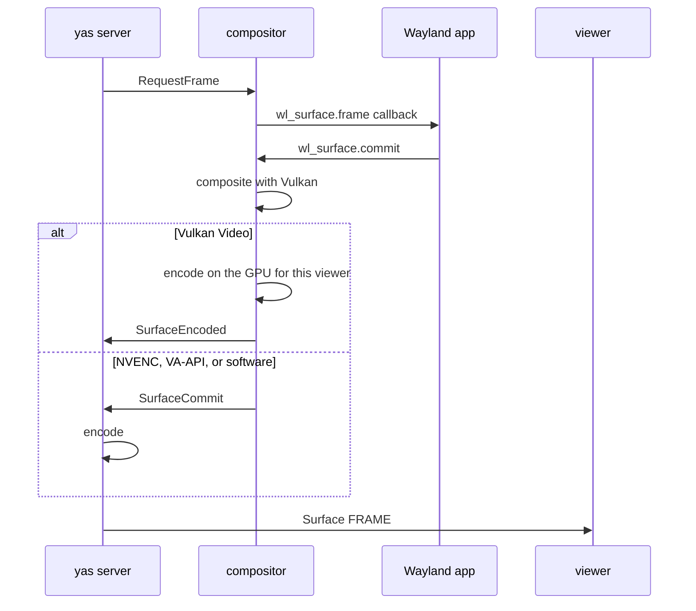

The compositor is a headless Wayland server inside `yas server`. GUI applications started in a yas terminal connect to it, and the server streams each window to viewers as video. This page describes how it works. The source is in [`crates/compositor`](https://github.com/yas-run/yas/tree/main/crates/compositor), with encoding in [`crates/server/src/surface_encoder.rs`](https://github.com/yas-run/yas/blob/main/crates/server/src/surface_encoder.rs). To run applications on it, see [Running GUI apps](/gui/running-gui-apps).

<Aside type="caution" title="Experimental">

The compositor and surface streaming are experimental. They run only on Linux. On macOS and Windows the compositor compiles to a stub and the server serves terminals only.

</Aside>

## Initialization

`ensure_compositor()` starts the compositor on its own OS thread with a calloop event loop. It listens on the first free `wayland-<N>` socket in `XDG_RUNTIME_DIR`, trying numbers 0 to 32. Every PTY started after that inherits `WAYLAND_DISPLAY`, so any program in any terminal can open windows. `YAS_SKIP_COMPOSITOR=1` starts the server without it.

```bash
yas terminal start -- sh -c 'echo WD=$WAYLAND_DISPLAY XR=$XDG_RUNTIME_DIR; sleep 30'
yas terminal show 7 | head -1
```

```text
7
WD=wayland-7 XR=/tmp/yas-1001
```

The compositor also starts a private D-Bus session whose activation environment points at its Wayland socket. PTYs receive it in `DBUS_SESSION_BUS_ADDRESS`. Desktop applications that need a session bus, the private PipeWire graph, the MPRIS bridge, and the compositor's portals all use this bus. yas never exposes the host session bus. Without `dbus-daemon`, the variable stays unset and those services are off.

The renderer loads Vulkan at startup and logs what it found. On a machine with only the llvmpipe software driver the server log shows:

```text
[compositor] trying Vulkan renderer for /dev/dri/renderD128
[vulkan-render] Vulkan Video encode not available (queue=false enc_queue=false h264=false enc_qf=None)
[vulkan-render] DMA-BUF extensions not available, SHM-only mode
[vulkan-render] initialized: llvmpipe (LLVM 21.1.8, 256 bits) (requested /dev/dri/renderD128)
[compositor] Vulkan renderer: true (dmabuf=false)
```

## Surface lifecycle

1. An application creates an `xdg_toplevel`. The server publishes an opaque Surface handle to every Surface watcher.
2. On each commit, the compositor sends `SurfaceCommit` with the composited pixels: an NV12 DMA-BUF, BGRA pixels, or linear float RGBA for managed color. For a viewer with a Vulkan Video session it also sends `SurfaceEncoded` with a finished bitstream.
3. The server forwards that bitstream, or encodes the pixels with the viewer's encoder.
4. Each `OPEN_VIEW` creates an independent stream of Surface `FRAME` events with its own size, codec, and credit.
5. Surface `KEY`, `TEXT`, `POINTER`, `AXIS`, and `TOUCH` events become Wayland input.
6. When the application closes the window, watchers receive the removal.

The server sends `RequestFrame` only for surfaces that have viewers and no request already pending, so an application that has not painted cannot cause a busy loop. If `OPEN_VIEW` must wait for a first frame to pick a codec, the wait does not block the session's other requests.

## Color management

The compositor advertises `wp_color_manager_v1` version 2 when the Vulkan renderer is active. Applications can tag buffers as Display-P3, DCI-P3, BT.2020 with PQ or HLG, Windows scRGB, or an ICC profile. Untagged buffers are sRGB.

- A surface tree with managed color is composited in linear BT.2020 RGBA16F with 203 cd/m² reference white. Untagged SDR trees keep the BGRA8 path.
- Each view chooses its own output: tone-mapped sRGB, Display-P3 SDR, or 10-bit AV1 BT.2020/PQ HDR. Viewers with different displays can watch one surface at the same time.
- `YAS_CHROMA` defaults to `444`. A view falls back to 4:2:0 when its encoder or browser cannot do 4:4:4.
- A color change rebuilds the encoder and starts with a keyframe.
- Captures keep managed color: PNG as 16-bit RGB with a `cICP` chunk, AVIF as 12-bit 4:4:4.

The viewer side is on [Color and HDR](/gui/color-and-hdr).

## Frame production pipeline



Server-side encoders start in parallel on blocking workers, with a ten-second deadline each. A slow encoder for one viewer does not delay another viewer's first frame. On resize, NVENC reuses a compatible session when the new size fits its 25% headroom per axis. Other backends build a new encoder. Every configuration change starts with a keyframe.

## GPU rendering and encoding

The renderer loads Vulkan through `ash` at runtime. Client buffers are uploaded to GPU textures at commit time and reused until the next commit:

- SHM buffers copy only damaged rows through a reusable staging buffer. Where `VK_EXT_external_memory_host` exposes the client's memory as device-local, Vulkan reads it directly. NVIDIA needs `YAS_ENABLE_EXTERNAL_MEMORY_HOST` for this because its driver copies the whole allocation.
- DMA-BUF buffers are imported with `VK_EXT_external_memory_dma_buf`.
- Idle GPU resources expire after five seconds without use, within fixed byte budgets.

Output takes one of three paths:

1. **Vulkan Video.** The compositor renders, converts BGRA to NV12 or NV24 in a compute shader, and encodes H.264 or AV1 on the same GPU. The server sends the bitstream without doing any encoding. Sessions are per surface and viewer, so each viewer gets its own size, keyframe cadence, and quantizer.
2. **Vulkan compute into VA-API surfaces.** VA-API allocates NV12 surfaces and exports them as DMA-BUFs. The compositor imports them and fills them with a compute shader. The encoder reads them with no CPU copy.
3. **CPU readback.** The compositor copies the frame to host-visible memory for software or NVENC encoding.

Each surface has its own output buffers, so several windows encode independently.

## Encoder selection

`YAS_SURFACE_ENCODERS` or `--surface-encoders` sets the preference list. The default is:

```text
av1-nvenc,h264-nvenc,av1-vaapi,h264-vaapi,av1-vulkan,h264-vulkan,h264-software,av1-software
```

The server tries each entry in order for each viewer and uses the first that works.

| Encoder                     | Backend                              | Notes                                                                   |
| --------------------------- | ------------------------------------ | ----------------------------------------------------------------------- |
| `av1-nvenc`, `h264-nvenc`   | NVIDIA NVENC through CUDA            | NVENC AV1 supports 4:2:0 only.                                          |
| `av1-vaapi`, `h264-vaapi`   | VA-API                               | VA-API has no H.264 4:4:4 profile.                                      |
| `av1-vulkan`, `h264-vulkan` | Vulkan Video on the compositor's GPU | No speed control.                                                       |
| `h264-software`             | openh264, or x264 in the GPL build   | 4:4:4 needs x264. `YAS_H264_SOFTWARE` picks one when both are built in. |
| `av1-software`              | rav1e                                | Capped at 3840x2160.                                                    |

- The Vulkan tier waits while any encoder ranked above it could still serve the viewer.
- A refused 4:4:4 Vulkan profile retries the same codec at 4:2:0 before falling to the next entry.
- Hardware AV1 goes up to 8192x4352. Every other encoder stops at 3840x2160.
- `YAS_SURFACE_BANDWIDTH` (default `ultra`) is a quality ceiling. The controller lowers quality under pressure and raises it again as the link recovers. It never lowers resolution.
- An unchanged surface is re-sent as a sharper keyframe after 400 ms, stepping toward the ceiling.
- Each view gets a fresh keyframe two seconds after its last one if deltas were sent since.
- `YAS_SURFACE_SPEED` (default `realtime`) sets how much encoder time a frame may take.

## Compositor capabilities

The compositor advertises these Wayland globals:

- Core: `wl_compositor` 6, `wl_subcompositor` 1, `wl_shm` 1, `wl_seat` 9, `wl_data_device_manager` 3.
- Shell: `xdg_wm_base` 6, `zxdg_exporter_v2` 1, xdg-decoration, `xdg_toplevel_drag_v1`, xdg-activation.
- Buffers and timing: `zwp_linux_dmabuf_v1` 4 and `wp_linux_drm_syncobj_manager_v1` when DMA-BUF import works, `wp_viewporter`, `wp_fractional_scale_manager_v1`, `wp_presentation`.
- Input: pointer constraints, relative pointer, cursor shape, primary selection, `zwp_text_input_manager_v3`.
- Color: `wp_color_manager_v1` 2 with the Vulkan renderer.

There is no session-wide output. Each client gets its own `wl_output` per toplevel, sized to its pane. The output scale is an integer; fractional zoom uses `wp_fractional_scale_v1`.

SHM accepts ARGB, XRGB, ABGR, and XBGR in 8-bit, 2:10:10:10, 16-bit integer, and 16-bit float layouts. DMA-BUF accepts the same formats where the Vulkan driver supports the format and modifier.

Chrome and Electron applications need `--ozone-platform=wayland`. mpv works with `--vo=gpu-next`.

## X11 applications

X11 clients reach the compositor through `xwayland-satellite`, which the server starts once per session when the binary is on `PATH`. The server picks a free display number from `:20` upward and exports `DISPLAY` before it starts the D-Bus session or any PTY. Applications also get `GDK_BACKEND=wayland,x11`, `QT_QPA_PLATFORM=wayland;xcb`, and `SDL_VIDEODRIVER=wayland,x11`, so Wayland stays first. `YAS_XWAYLAND=0` turns the bridge off.

All X windows share the bridge's single Wayland connection. The compositor identifies that connection by process ID and gives it one screen, sized to its largest window, instead of one output per window.

## Native surface delivery

Surface catalogue records arrive through the Surface family's state snapshot and deltas. Each view receives its own frame and frame-chunk events, with keyframes, codec changes, and ACK pacing set by its negotiated limits. Clipboard content uses the Selection family and audio uses the Media family.

## Testing surfaces without a browser

You can drive surfaces entirely from the CLI. This session starts Chrome as a Wayland client and types into it:

```bash
yas terminal start -- google-chrome --ozone-platform=wayland --no-first-run \
  --user-data-dir=/tmp/chrome-test 'data:text/html,<title>yas docs</title><input autofocus><h1>hello</h1>'
yas surface list
```

```text
9
ID	TITLE	SIZE	APP_ID
3	yas docs - Google Chrome	1920x1080	google-chrome
```

`yas terminal start` prints the terminal ID. `yas surface list` prints one tab-separated row per window: surface ID, title, size in pixels, and Wayland app ID.

```bash
yas surface click 3 100 50
yas surface type 3 'hello'
yas surface key 3 Return
yas surface capture 3 -o after.png
```

```text
after.png
```

- `yas surface capture ID` writes `surface-<ID>.png` by default. `-o` sets the path; a `.avif` extension writes AVIF.
- `yas surface type` sends US-QWERTY keystrokes and accepts `{Return}` and `{ctrl+a}`. `yas surface text` commits the literal text, so non-ASCII characters arrive intact.
- `yas surface record` writes the raw encoded video of a surface.

See [yas surface](/reference/cli/surface) for every subcommand.
