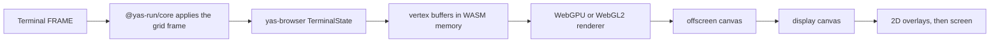
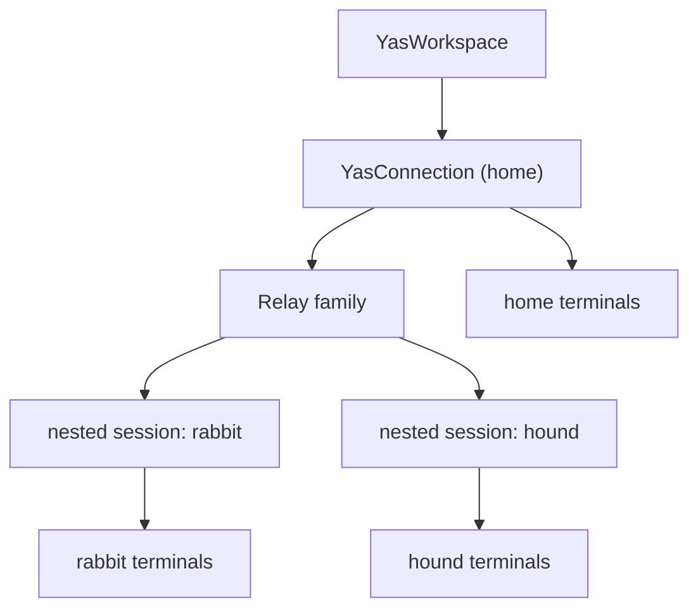

The yas frontend is the browser client that renders terminals and surfaces. It is split across a Rust crate compiled to WebAssembly, [`crates/browser`](https://github.com/yas-run/yas/tree/main/crates/browser) (`yas-browser`), a TypeScript core, [`js/core`](https://github.com/yas-run/yas/tree/main/js/core) (`@yas-run/core`), and the Solid UI in [`js/ui`](https://github.com/yas-run/yas/tree/main/js/ui). The same core powers the [React](/embedding/react) and [Solid](/embedding/solid) components. This page describes how it works.

## Render pipeline

`@yas-run/core` decodes each negotiated `yas.terminal.grid/1` frame, checks its sequence and baseline, and applies it. It then serializes the complete grid through a private boundary into the WASM renderer. No protocol frame, family ID, or resource handle crosses that boundary.

## WASM runtime

`yas-browser` compiles to `wasm32-unknown-unknown`. Its `TerminalState` receives the LZ4-compressed grid through `feed_compressed()`. When the render loop calls `prepare_render_ops()`, it:

1. Walks every cell of the grid.
2. Resolves foreground and background colors through the palette, including default colors and bold and dim modifiers.
3. Merges adjacent cells with the same background into one rectangle.
4. For each visible glyph, builds a `GlyphKey` (the UTF-8 bytes plus bold, italic, underline, and wide flags), makes sure the atlas has it, and emits six vertices with atlas coordinates.
5. Exposes the vertex arrays to JavaScript as pointers into WASM memory (`bg_verts_ptr`, `glyph_verts_ptr` and their lengths). JavaScript reads them as typed-array views without copying.

The runtime also answers hyperlink hit tests (`link_at`, `link_segments`).

## Glyph atlas

The glyph atlas is an `HTMLCanvasElement` drawn with a 2D context. When the renderer needs a new glyph it:

1. Allocates a slot with row-based packing. The atlas is a power of two between 2048 and 8192 pixels.
2. Sets the font (`bold italic Npx family`) and draws the glyph in white with `fillText()`. Underlines are stroked.
3. Caches the slot in an `FxHashMap<GlyphKey, GlyphSlot>`.

The renderer uploads the atlas to the GPU once per frame, and skips the upload when the atlas has not changed. Shaders tint white glyphs with the vertex color and pass color glyphs such as emoji through unchanged.

## GPU renderers

`TerminalStore` picks a backend in this order:

1. **WebGPU**, when `navigator.gpu` returns an adapter. The probe runs in the background when the store is created.
2. **WebGL2**, which renders frames while the WebGPU probe is still running and whenever WebGPU is unavailable.
3. **Canvas 2D**, when neither GPU API exists, such as in some headless browsers.

All three implement the same renderer interface and read the same vertex buffers. Once the WebGPU probe succeeds, the store switches to it.

### WebGPU renderer

Two WGSL pipelines draw each frame:

- **Rectangles** for cell backgrounds and the cursor: `pos` (float32x2) and `color` (float32x4), a 24-byte stride.
- **Glyphs** as textured atlas quads: `pos` (float32x2), `uv` (float32x2), and `color` (float32x4), a 32-byte stride. The atlas is copied with `copyExternalImageToTexture` using premultiplied alpha.

Both use premultiplied-alpha blending (`one`, `one-minus-src-alpha`).

### WebGL2 renderer

Two shader programs do the same work with the same vertex attributes. Each draw call batches up to 65,532 vertices.

### Render loop

`YasTerminalSurface` renders on demand from `requestAnimationFrame`:

1. Call `prepare_render_ops()` in WASM.
2. Create `Float32Array` views over the vertex buffers.
3. Draw background rectangles, glyph quads, and the cursor to an offscreen canvas.
4. Copy it to the display canvas with `drawImage`.
5. Draw 2D overlays: selection, link underlines, predicted echo, and the scrollbar.

A pane sends its size only after its container has a nonzero measurement, so a hidden pane never resizes the PTY to 1×1.

## Input handling

### Keyboard

A hidden `<textarea>` captures keys. `keyToBytes()` in [`js/core/src/keyboard.ts`](https://github.com/yas-run/yas/blob/main/js/core/src/keyboard.ts) turns each `KeyboardEvent` into terminal bytes:

- Ctrl+letter sends the control code, such as `0x03` for Ctrl+C.
- Arrow keys send `\x1b[A` through `\x1b[D`, or `\x1bOA` through `\x1bOD` in application cursor mode.
- Modified keys use the `\x1b[1;{mod}X` form. Alt adds an `\x1b` prefix.
- Enter sends `\r`. Ctrl+Enter sends `\x1b[13;5u`.

Applications can turn on the Kitty keyboard protocol. yas supports all five progressive enhancement flags and keeps separate flag stacks for the normal and alternate screens. The flags travel with the terminal grid state.

### Mouse

Mouse input uses the Terminal `MOUSE` event. The server encodes it for the PTY's current mouse mode and encoding (X10, VT200, SGR, or pixel). Text selection and copy happen in the browser, whatever mouse mode the application has set.

### Copy and paste

- A selection outside the rendered viewport is fetched with a server `COPY_RANGE` request. The browser reserves the clipboard write during the click so its user activation does not expire.
- OSC 52 clipboard writes from PTY output are ignored.
- When a Wayland application owns the clipboard, a paste in a terminal on the same connection reads that selection directly through the Selection family.
- A paste into a surface holds back the V key press until the clipboard content has been stored on the server, then releases the keys in order. A 10-second timer releases held modifiers if the browser never answers.

### Predicted echo

The server sets mode bits for echo and canonical mode from `tcgetattr`. When the PTY's echo bit is on, `YasTerminalSurface` draws typed characters as a dimmed overlay before the server confirms them. Text prediction at shell prompts is gated separately: it runs when the application is not on the alternate screen and has not requested all-key reporting, because interactive shells turn both echo and canonical mode off to do their own line editing.

## Workspace and connection model

`YasWorkspace` owns the connection to the home server and one nested session per route opened through its Relay catalogue. Each server has its own handle namespace, so the UI identifies a resource by route plus handle.

When the page becomes visible or the network comes back, the UI retries a disconnected home connection immediately. Connected transports and nested sessions stay as they are, so background audio keeps playing.

A workspace is the saved layout around those sessions. The home server stores it in KV: selected routes, pane layout, pane assignments, focus, and panel state. Browser URLs carry `#workspace=<id>`. Layout changes use compare-and-swap retries. The record format is in [docs/design/workspace-sessions.md](https://github.com/yas-run/yas/blob/main/docs/design/workspace-sessions.md). Usage is in [Workspaces](/browser/workspaces).

## Surface video decoding

The browser decodes surfaces with the WebCodecs `VideoDecoder`:

- The codec comes from Surface view negotiation. Frame flags mark keyframes, codec configuration, and discardable frames.
- The decoder is configured with `optimizeForLatency: true` and with the stream's encoded dimensions.
- Frame credit advances when the decoder's output callback delivers a frame, so a platform decoder cannot hide a deep internal queue.
- `YasSurfaceView` draws each decoded `VideoFrame` to a canvas.

### Presentation scheduling

`SurfaceStore` paints at display refresh in one of two modes:

- **Newest wins** while a surface is idle or responding to input: it paints the latest decoded frame and drops older ones.
- **Timestamp scheduled** after 8 consecutive frames without a gap: it paints each frame on the refresh that its capture timestamp maps to.

The scheduler measures `arrival − timestamp` over the last second and ignores one outlier. The 2nd percentile is the fast-path baseline. Added playout delay is capped at 96 ms. A server with a protocol RTT of 2 ms or less is treated as local and skips scheduling.

A gap of more than 250 ms in capture timestamps, a timestamp that goes backwards, or a hidden tab resets the presenter to newest wins. The reset keys on capture time: a source that went idle and then paints again gets its next frame immediately, while frames delayed in transport keep their schedule.

## Font serving

The home server serves fonts through the Font family. `yas-fonts` scans system font directories plus `YAS_FONT_DIRS` and records each face's family, style, weight, metrics, embedding permissions, and BLAKE3 hash. `LIST` and `DESCRIBE` show only faces whose embedding bits allow export, without file paths. `FETCH` returns a face's bytes. `YAS_FONT_EXPORT=0` empties the catalogue. There are no HTTP font routes, and the edge does not serve fonts.

The browser describes only the families it needs and builds `FontFace` objects from the fetched bytes. It verifies each face's hash and then caches the bytes in the IndexedDB database `yas-fonts` under that hash, so the same face is reused across servers. A newly fetched face is reported ready only after the cache write commits.
