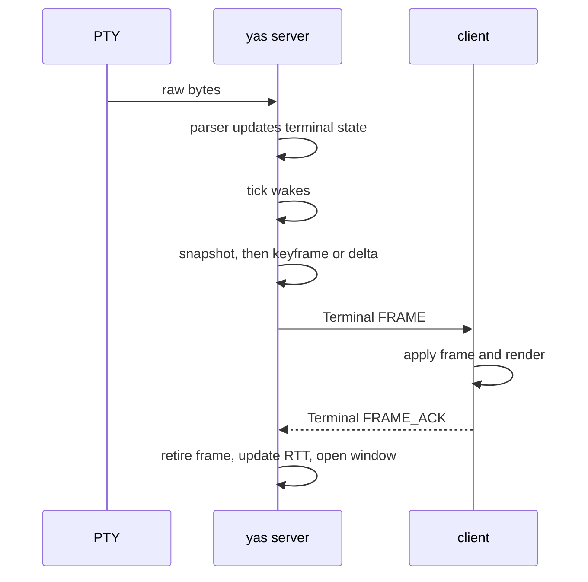
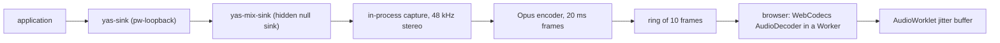

The yas server is one tokio process that owns every terminal, process, and compositor surface on a machine and serves them to clients over the [yas protocol](/internals/protocol). This page describes how its terminal, process, pacing, camera, and audio paths work. The compositor has its own page, [Compositor internals](/internals/compositor). The source is in [`crates/server`](https://github.com/yas-run/yas/tree/main/crates/server).

## Configuration

`yas server` reads its settings from flags and environment variables once at startup. A flag wins over the matching variable. Extension and channel limits are deployment settings that the server resolves once, with `--ext-*` and `--channel-*` flags overriding `YAS_EXT_*` and `YAS_CHANNEL_*` variables. Every variable is listed in [Environment variables](/reference/environment-variables).

### Named instances

Every server has a name, `default` unless you pass `--name` or set `YAS_SERVER_NAME`. The name selects the socket (`yas-<name>.sock`) and a state directory `yas/instances/<name>/` holding `kv.redb`, `extensions.redb`, the extension object cache, and the default muster directory. Clients address an instance as `local:NAME`.

Before it opens any persistent service, the server locks `<kv-path>.server.lock`. A second server that resolves the same KV path exits. This stops two servers with different sockets from sharing one KV database. File layout is in [Configuration files](/reference/configuration-files#instance-state-and-cache). Usage is in [Named instances](/terminals/named-instances).

### Capacity limits

`YAS_MAX_CONNECTIONS` and `YAS_MAX_PTYS` bound runaway automation. They are not a security control: a client that can open one PTY can already use the machine's resources from inside it. A Terminal `CREATE` refused by `YAS_MAX_PTYS` gets a correlated `RESOURCE_EXHAUSTED` result, and the server logs the refusal.

## Native non-PTY processes

The Process family runs children from an argument vector, without a shell or a PTY, and carries binary stdin, stdout, and stderr. The design is [docs/design/processes.md](https://github.com/yas-run/yas/blob/main/docs/design/processes.md).

- Every child has a server-boot-scoped `process_ref`. Any client with process access can list, watch, and control any child. There is no per-client confidentiality boundary.
- Each watch has its own output flow control. A watch that falls behind closes its endpoint, which removes that endpoint's watches, instead of stalling the child or other endpoints.
- Total watches and watches per child are capped. Admission returns `BUDGET` when either cap is full.
- One watch at a time writes stdin. The creator starts as the writer. After it unwatches or disconnects, the next `WATCH` that requests the stdin role takes it.
- An ordinary child dies when the endpoint that created it closes. A detachable child survives with zero watchers and keeps a watchable final result for `YAS_PROCESS_DETACHED_RESULT_TTL`.
- The server uses process groups on Unix and kill-on-close job objects on Windows.
- A lifecycle frame that carries a cleanup guard has a 10-second write deadline. A connection that cannot drain it is closed.

A child runs as the server's user and is not sandboxed, the same as a PTY command. Disable the family with `YAS_PROCESS=0` or `yas server --no-processes`.

Process and Terminal launch records carry an explicit environment base (the server environment or an empty one) and exact key and value bytes to set or remove. Direct argv is never split or re-quoted. The selected `PATH` decides where the server looks for the program.

## PTY lifecycle

### Creation

A Terminal `CREATE` request makes the server do this:

1. Allocate a PTY pair with `openpty`.
2. Resolve the program, build `argv`, and build the child environment. All of this happens before `fork`, because only async-signal-safe calls are legal after it. A NUL byte in an argument or a missing program fails the request here.
3. Fork. The child makes the PTY its controlling terminal (`TIOCSCTTY`), closes inherited descriptors except stdio, changes to the working directory, and calls `exec`. An inaccessible working directory fails the request.
4. Start a reader thread that sends PTY bytes and synchronized-output boundaries through a bounded channel to the delivery tick.
5. Return the opaque terminal handle, state revision, and generation in the correlated result. Clients watching Terminal state receive the new record.

The child runs as the server's user. There is no `setuid`, `setgid`, `chroot`, or seccomp in the tree. Closing descriptors keeps one terminal from reaching another's PTY master or the server socket. It does not separate a client from the machine.

Creation does not open a view. A caller can include an `initial_view` extension or send `OPEN_VIEW` later. The terminal remembers its launch (argv or command, directory, environment), so `RESTART` in `REPLAY` mode reruns it and `REPLACE` stores a new launch.

### Exit

The server records the exit status from `waitpid`:

- Normal exit: the exit code.
- Death by signal: the negative signal number, such as `-9` for `SIGKILL`.
- Unknown: `i32::MIN`.

The server publishes the exit only after the reader has delivered EOF, so every output byte is parsed first. If a descendant still holds the PTY open, the server asks the reader to drain after 50 ms: the reader forwards the bytes already pending in the kernel and then sends EOF.

Watchers receive an `EXITED` state record with the exit status. The terminal and its scrollback stay readable until `CLOSE` or retention removes them (`YAS_MAX_EXITED`, `YAS_EXITED_LINGER`). `RESTART` starts a new generation on the same handle.

### Multi-client state

- **Catalogue**: each client watches revisioned Terminal state on its own.
- **Views**: `OPEN_VIEW` creates a client-local view with its own dimensions, frame rate, codec, and credit. Only open views receive Terminal `FRAME` events.
- **Focus**: `SET_FOCUS` is per view. Focused views get the lead budget. Background views share the preview budget.
- **Size**: the PTY uses the smallest rows and columns across active views. Frames report that shared grid, so every viewer sees the same text, cursor, and scrollback. Closing or resizing a view recomputes it.

## Terminal emulation

The server parses PTY output with a vendored Alacritty parser (`yas-alacritty-terminal`), wrapped by [`crates/alacritty-driver`](https://github.com/yas-run/yas/tree/main/crates/alacritty-driver). The wrapper adds:

- **Snapshots**: converts the terminal into the protocol's cell grid once per scheduled frame.
- **Scrollback frames**: renders any scroll offset without changing live state.
- **Mode tracking**: watches raw output for mode changes such as `DECCKM`, `DECSCUSR`, mouse modes, SGR mouse encoding, synchronized output, and the alternate screen, and packs them into the 16-bit mode field of each frame.
- **Search**: full-text search over the screen, titles, and scrollback.

The server also polls `tcgetattr` on the PTY about every 250 ms. It sets mode bit 9 when echo is on and bit 10 when canonical mode is on, which the browser uses for predicted echo.

## Per-client frame pacing

The server keeps congestion state for every client, so no client can slow another.

### RTT estimation

Each Terminal `FRAME` increments an in-flight count. `FRAME_ACK` reports the presented sequence, decoder queue depth, and free frame slots, and retires acknowledged frames. The server tracks an exponentially weighted RTT and a slowly decaying minimum RTT.

### Bandwidth estimation

- **Delivered rate**: a weighted average of frame bytes over delivery time.
- **ACK goodput**: bytes acknowledged per ACK interval.
- **Jitter**: a weighted average of delivery-time variance with a decaying peak. It lowers the bandwidth floor the server assumes.

### Frame window

Frames in flight are limited by a frame count derived from RTT and display rate and by a byte budget derived from the bandwidth-delay product. High-latency links get a deeper pipeline. Local links get almost none.

### Display pacing

The client sets each view's maximum frame rate with `CONFIGURE_VIEW`. The server spaces sends to match the client's measured render rate and backs off when the client's queue grows.

Terminal frames are deltas against the view's baseline, which advances only after a complete frame is written to that view. A reset, resize, scroll, or backend restart forces a keyframe. Each view has its own baseline. A frame uses the lossless LZ4 grid wrapper when that saves at least eight bytes.

Terminal and Surface feedback are separate. A burst of shell output does not slow a video surface, and a congested surface does not slow its neighbours. Surface views learn their own send-to-ACK turnaround and size their byte credit from measured goodput plus one frame of probe credit.

### Preview budgeting

Background views share the bandwidth left after the focused view is served. Their frame rate is capped so they cannot starve the focused terminal.

### Probe and backoff

After a backoff, the server grows the window one step at a time. It discards probe frames when queue delay rises. A fast local client gets its full display rate. A slow mobile client gets its link capacity.

## Frame scheduling flow

## Camera media input

A viewer can lend its camera to applications on the server. The server decodes the compressed frames in-process and publishes them as a PipeWire camera. FFmpeg is not used, and no decoder subprocess runs.

- Software H.264 and AV1 decoders are compiled in. NVDEC, VA-API, and Vulkan Video are used through their native APIs when selected.
- `YAS_MEDIA_CAMERA_DECODERS` is the decoder preference list, `nvdec,vaapi,vulkan,software` by default. The server uses the first one that opens and decodes the stream. Software is always the last fallback.
- `YAS_CUDA_DEVICE`, `YAS_VAAPI_DEVICE`, and `YAS_MEDIA_CAMERA_VULKAN_DEVICE` select the device for each hardware backend.
- `--camera-codecs` or `YAS_MEDIA_CAMERA_CODECS` narrows the formats viewers may send (`mjpeg`, `h264`, `av1`, `h264-444`, `av1-444`). `--microphone-codecs` or `YAS_MEDIA_MICROPHONE_CODECS` does the same for `pcm` and `opus`. `mjpeg` and `pcm` are always accepted. An invalid flag stops the server. An invalid variable is ignored.
- A hardware failure on a keyframe retries the same keyframe on the next backend. A failure on a delta drops the dependent frames and requests a new keyframe.

The server's user needs access to the GPU device nodes, such as `/dev/dri/renderD*` for VA-API and Vulkan. Without access, decoding falls through to software.

## Audio

Audio runs through a private PipeWire graph per compositor, encoded as Opus and played by the browser. Disable it with `YAS_AUDIO=0`. It is also off when the PipeWire binaries or `libpipewire-0.3.so.0` are missing.

### Capture

`AudioPipeline::spawn()` starts `dbus-daemon`, `pipewire`, `wireplumber`, `pw-loopback`, and `pipewire-pulse` on private sockets. Children inherit `PIPEWIRE_REMOTE`, `PULSE_SERVER`, and `PULSE_RUNTIME_PATH`. Applications play into `yas-sink`, which the server pins as the default sink and which feeds the hidden `yas-mix-sink`. The server loads `libpipewire` at runtime and captures the mixer's monitor in-process with a quantum of 1024 samples at 48 kHz.

### Encoding

The encoder task cuts PCM into 20 ms frames (960 samples per channel) and encodes them with libopus at `YAS_AUDIO_BITRATE`, 64000 bits per second by default. Frames carry timestamps on the same clock as video frames. When the frame channel is full, the encoder drops frames so PipeWire's realtime thread never blocks. A ring of the last 10 frames (200 ms) gives new listeners a catch-up burst.

### Transport

The browser opens the audio output with Media `OPEN_OUTPUT` and receives Opus in Media `FRAME` events, returning credit with `FRAME_ACK`. Frames can use a WebTransport or WebRTC datagram lane when one is available. The reliable path is always the fallback.

### Playback

`AudioPlayer` in [`js/core`](https://github.com/yas-run/yas/blob/main/js/core/src/AudioPlayer.ts) decodes in a Worker and plays through an `AudioWorklet`:

- The jitter buffer starts at 60 ms. Each underrun grows the target by five 20 ms frames, up to 400 ms. The target shrinks by one frame after 5 seconds without an underrun.
- A learned floor, up to 200 ms, remembers what the link needed and decays over 30 seconds, so recurring jitter does not cause repeated gaps.
- Playback rate is steered within ±2% to hold the buffer at its target.
- The browser measures the difference between audible audio and the focused surface's visible video and sends it as Media `PLAYOUT_REPORT`. The server publishes the largest current report as PipeWire `ProcessLatency` on `yas-sink`. Players such as Chromium read that latency and delay their own video. yas never delays the compositor or the browser canvas.
