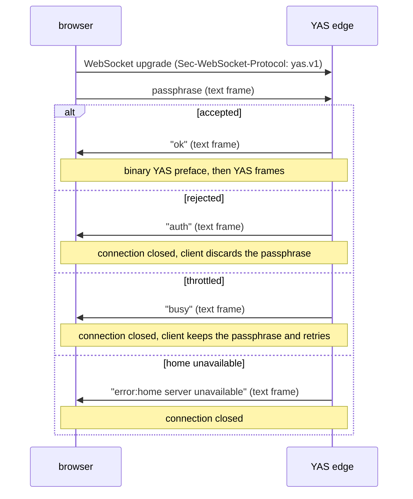
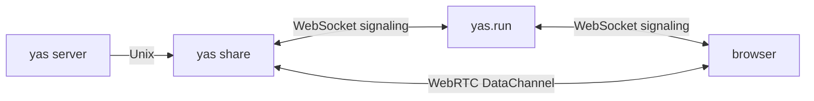
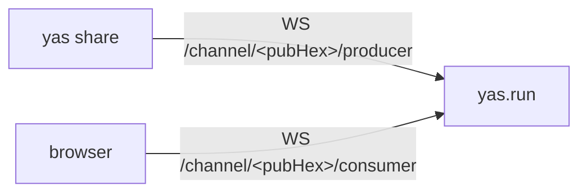
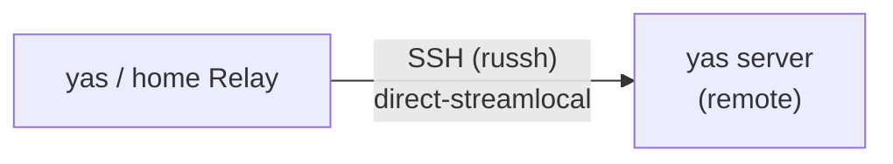
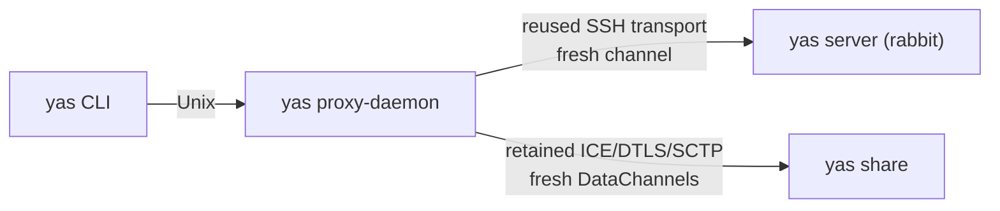

# Transports

Every YAS session has an authoritative ordered, reliable path. Native sockets,
TCP, SSH, WebSocket, WebTransport, and the reliable WebRTC DataChannel all
carry the same protocol. WebTransport and WebRTC can additionally expose an
unreliable datagram path for eligible Events; every such Event has a reliable
fallback. A listener selects YAS before framing begins and never sniffs or
falls back to another protocol. The wire is specified in
[design/yas.md](design/yas.md), with exact generated layouts in
[the wire registry](../protocol/yas/wire.md).

The standard browser topology is deliberately simple: a YAS edge authenticates
one session at `/edge` and adapts it to one fixed home YAS socket. WebSocket is
always available; an enabled WebTransport listener adds native datagrams.
The home server owns remote discovery and connections through Relay. The edge
has no destination, configuration, or font side channel. Native CLI/proxy
targets and custom browser embeddings can use WebTransport when a
WebTransport endpoint is available.

## Transport abstraction

### Rust (`yas-cli`)

`crates/cli/src/transport.rs` defines a `Transport` enum:

```rust
enum Transport {
    #[cfg(unix)]
    Unix(tokio::net::UnixStream),
    #[cfg(windows)]
    NamedPipe(tokio::net::windows::named_pipe::NamedPipeClient),
    Tcp(tokio::net::TcpStream),
    Duplex(tokio::io::DuplexStream),
    WebRtc {
        stream: tokio::io::DuplexStream,
        datagram: DatagramTransport,
    },
    Web {
        reader: Box<dyn AsyncRead + Unpin + Send>,
        writer: Box<dyn AsyncWrite + Unpin + Send>,
        datagram: Option<DatagramTransport>,
    },
}
```

All variants expose the reliable halves and any independent datagram transport
via `split_with_datagram()`. The rest of the CLI is transport-agnostic.

### TypeScript (`@yas-run/core`)

The `YasTransport` interface abstracts over WebSocket, WebTransport, WebRTC,
and custom streams:

```typescript
interface YasTransport {
  readonly yasFraming?: "message" | "stream";
  readonly maxDatagramSize?: number;
  connect(): void;
  send(data: Uint8Array): void;
  sendDatagram?(event: Uint8Array): void;
  close(): void;
  readonly status: ConnectionStatus;
  addEventListener(
    type: "message" | "datagram" | "statuschange",
    listener: Function,
  ): void;
  removeEventListener(type: string, listener: Function): void;
}
```

Any implementation of this interface can be passed to `YasWorkspace`.

---

## Unix domain socket

`yas server` binds one native YAS listener. A listener never sniffs the first
bytes to choose a protocol.

`YAS_SOCK` is an exact explicit override. Without it, automatic sockets are
placed below a private directory created with mode `0700`. Resolution prefers
an absolute, effective-user-owned, owner-only `$XDG_RUNTIME_DIR`, then a safe
`$TMPDIR`, `/run/user/$UID`, and finally `/tmp`. A private base uses its `yas/`
child; a root-owned sticky shared temporary directory uses `yas-$UID/` so the
result is still per-user. Relative paths, symlink bases, wrong-owner bases,
non-sticky shared directories, and paths too long for Darwin's native Unix
socket limit are ignored. The server rechecks the private parent's ownership
and exact mode immediately before binding or removing a stale automatic
socket, and rejects a prebound symlink or non-socket final path.

The packaged NixOS system-service socket
`/run/yas/$USER/yas-$YAS_SERVER_NAME.sock` is a safe discovery candidate:
`/run/yas` must be root-owned and non-writable, the per-user directory must be
owned by the effective user with mode `0700`, and the socket must be owned by
that user. The legacy systemd socket unit's direct
`/run/yas/$USER-$YAS_SERVER_NAME.sock` path remains discoverable under the
same ownership checks. Explicit socket paths are not relocated; their
containing-directory policy remains the operator's responsibility.

`YAS_SERVER_NAME` defaults to `default`. The CLI, edge, and SSH transport
consider only name-suffixed sockets; there is no unnamed socket probe.

The server exposes the resolver result to extensions as the derived
`YAS_SOCKET_TEMPLATE` environment entry, with one literal `{name}` placeholder.
It always predicts automatic named YAS endpoints and is independent of an
explicit `YAS_SOCK`; Muster uses it for `${YAS_SOCKET}` only after validating
the template, name grammar, and final native path length.

The edge, CLI, SSH, proxy, and Relay connectors all resolve this same native
endpoint.

### systemd socket activation

When `LISTEN_FDS=1` is set, the server adopts fd 3 as its listening socket instead of binding. Provided units:

| Unit                                         | Scope                | Socket                        |
| -------------------------------------------- | -------------------- | ----------------------------- |
| `yas-server.socket` / `yas-server.service`   | user                 | `%t/yas/yas-default.sock`     |
| `yas.socket` / `yas.service`                 | user                 | `%t/yas/yas-default.sock`     |
| `yas-server@.socket` / `yas-server@.service` | system, per-user     | `/run/yas/%i-default.sock`    |
| `yas-share@.service`                         | system, per-instance | reads `/etc/yas/share-%i.env` |

A server can host the browser edge and the WebRTC share itself — `yas server
--edge --share`, or `YAS_EDGE=1` / `YAS_SHARE=1` — which is one unit instead of
three and drops the socket hop between them. The separate units remain for a
edge or share that fronts a server it does not live with.

An adopted listener keeps the credentials systemd captured when it called
`listen()`, so clients of a system-scope `yas-server@%i.socket` read peer UID
`0` and PID 1 rather than `%i`. Peer-UID verification accounts for that by
accepting root; nothing in a unit needs `YAS_SERVER_UID` to compensate. The
user-scope units are unaffected either way — `systemd --user` already runs as
the target user.

The socket file only exists while the `.socket` unit owns it. Deleting it by
hand does not free the address: the unit keeps the bound listener and hands the
same fd to every restart of the service, so clients get `ENOENT` until the
`.socket` unit itself is restarted.

### fd-channel

An external process can pass pre-connected client file descriptors to the server via `SCM_RIGHTS` ancillary messages. Configure with `--fd-channel FD` or `YAS_FD_CHANNEL=<fd>`. The server calls `recvmsg()` and treats each received fd as an already-connected client stream. This is the integration point for embedding yas server inside a custom service manager or sandbox.

Closing the channel shuts down the server. SIGTERM, SIGINT, and native Shutdown
requests stop both the fd-channel receiver and the ordinary socket listener;
shutdown remains visible to either task if it starts waiting later.

---

## WebSocket

`yas edge` (and the CLI's embedded edge) accepts the exact `/edge` WebSocket
path from browsers only when the client offers the `yas.v1` subprotocol.

### Auth handshake



`"busy"` means the auth throttle refused the handshake before looking at the
passphrase — a peer lockout or the global concurrent-handshake cap. It is
deliberately distinct from `"auth"`: a client that conflates the two throws
away a working credential and drops the user at the login screen for what is a
transient server condition.

Before returning `"ok"`, the edge connects the one native home IPC socket
selected by `YAS_SOCK` (or normal YAS socket resolution) and reads the peer UID
from the connected stream's kernel credentials (`SO_PEERCRED` on Linux,
`getpeereid` on Darwin/BSD). It refuses the stream unless that UID matches the
edge process's effective UID or is `0`. An intentional cross-UID deployment
must set `YAS_SERVER_UID` to the expected numeric UID; there is no option to
skip the check. This applies equally to standalone `yas edge` and the embedded
`yas open` edge, including explicit `YAS_SOCK` paths. Explicit non-home Unix
transports retain their separate trust model.

Root is accepted alongside the expected UID because these credentials describe
whoever called `listen()`, not whoever `accept()`ed. A socket-activated server
therefore authenticates as its service manager — see
[systemd socket activation](#systemd-socket-activation) — and a peer that is
already root could enter the expected UID anyway. The check still excludes
every other unprivileged user, which is what it is for.

The client then sends the eight-byte YAS preface as one binary message and
immediately sends Core HELLO as the next. The edge forwards the preface raw.
Every later WebSocket message is exactly one YAS frame, so the edge only adds
or removes the home socket's four-byte frame-length prefix. It does not parse
the frame header, family, kind, or payload and cannot select a destination.

The passphrase grants the browser the home server's full authority. The auth
exchange is not encryption: any edge reachable beyond loopback must be placed
behind WSS/TLS, normally at a reverse proxy. Plain `ws://` on an untrusted
network exposes the bearer passphrase to passive observers.

The auth throttle ignores forwarding headers by default. When a TLS proxy and
the edge share a host or private network, set `YAS_TRUSTED_PROXY_IPS` to the
proxy's exact comma-separated IP addresses. Only a direct peer on that list may
contribute `X-Forwarded-For`; the edge walks its bounded chain from right to
left and uses the first untrusted address. Never list a public client range or
configure the proxy to pass an untrusted header through without appending the
actual client address. Without this setting all users behind one proxy share a
single conservative auth-admission and lockout key.

WebSocket has no unreliable companion. Events that are eligible for a
datagram use their reliable encoding on this transport. With
`YAS_WEBTRANSPORT=1`, the edge also advertises a TLS WebTransport listener to
the bundled UI. Its authenticated bidirectional stream carries the same native
YAS byte stream, while each QUIC datagram is one complete Event. The edge maps
the pair to the home server's composite local ingress, so the server negotiates
a nonzero receive ceiling without mixing optional packets into the reliable
socket.

`YAS_WEBTRANSPORT_ADDR` selects the UDP bind and
`YAS_WEBTRANSPORT_PUBLIC_PORT` is the port the page tells browsers to dial.
`YAS_WEBTRANSPORT_CERT` and `YAS_WEBTRANSPORT_KEY` load a stable PEM identity.
When omitted, the edge generates a browser-compatible short-lived certificate
and advertises its hash; that mode is for development because a restart changes
the pin. `YAS_WEBTRANSPORT_PIN_CERT=1` advertises the hash of a supplied
certificate too, which requires the browser's short-validity certificate-hash
rules. The TCP/WSS and UDP/QUIC ports may have the same number.

The bundled UI fetches `/edge-transport.json` without caching before each
WebTransport connection attempt, including automatic and manual reconnects,
so a restarted edge's certificate hash replaces the previous pin. Failed
discovery retries with the transport's backoff.

## WebTransport

WebTransport carries the YAS preface and reliable length-framed session on one
bidirectional QUIC stream. `@yas-run/core` exposes
`YasWebTransportTransport`; the CLI and `yas proxy-daemon` accept native
`wt://` targets and adapt the selected bidirectional stream to the same byte
stream used by the rest of the CLI.

The CLI/proxy URI form is:

```text
wt://host[:port]/?certHash=<sha256-hex>#secret
```

Port 443 is the default. Without `certHash`, the client verifies the server
through system roots. With it, the exact SHA-256 certificate hash is pinned.
The `passphrase` and pin stay in the proxy's target URI so a pooled connection
can be recreated.

WebTransport also supplies native unreliable datagrams. One transport
datagram contains one complete unframed YAS Event and never a stream length.
The usable maximum is bounded by the peer's Core HELLO advertisement, the
physical WebTransport session, and the protocol hard maximum of 65,536 bytes.
Loss, duplication, and reordering are visible to the owning family. Failure of
the optional datagram path does not close the reliable session.

The edge watches WebTransport session closure independently of stream writes,
so a vanished client releases its home-server connection even under
backpressure. A separate receive watchdog expires after 30 seconds without
incoming QUIC packets, checked once per second. Outbound traffic cannot reset
this deadline; QUIC's own idle timeout can restart on a send and is not a hard
30-second bound after the peer disappears. QUIC keepalives every 10 seconds
elicit acknowledgements from healthy idle peers without requiring YAS traffic.
Losing the datagram path leaves reliable forwarding and disconnect detection
active. This detects transport loss, not a stalled browser application whose
network process still acknowledges packets.

## WebRTC DataChannel

`yas share` bridges a YAS server to browsers over WebRTC using `str0m` (a sans-I/O WebRTC library). No edge is involved — the browser connects directly to the forwarder via the signaling hub.



### DataChannel framing

An ordered, reliable DataChannel labeled `"yas.v1"` is a byte-transparent YAS
stream: the native preface followed by 4-byte LE length-prefixed frames,
identical to the Unix socket protocol. The forwarder connects to `yas server`
when the channel opens, negotiates a server-enforced read-only catalogue, and
admits the consumer only after the native HELLO completes.

Browser reliable writes are split at the negotiated SCTP message limit
(`RTCSctpTransport.maxMessageSize`). str0m 0.23.1 advertises and accepts
256 KiB, so a 64 KiB Transfer payload plus its protocol headers fits in one
message. Message boundaries do not delimit YAS frames. Native reliable writes
use 64 KiB chunks to fit within str0m's 128 KiB aggregate send buffer.

The producer reserves up to 16 MiB per reliable channel for incoming messages
waiting to reach the server, including the chunk currently being written.
Each message reserves its byte length, with a 1 KiB minimum to bound queue
overhead. Small ACK, pointer, and resize bursts therefore share the byte
allowance instead of exhausting a 16-message queue. Empty messages consume
no reservation. Messages larger than 1 MiB are rejected before copying.
`YAS_WEBRTC_VERBOSE=1` reports the peer and channel, closure reason, incoming
message size, and reserved budget, distinguishing exhaustion from a closed
local writer.

### Optional datagram channel

Peers that support native datagrams open a second DataChannel labeled
`"yas.v1.datagram"` with `ordered: false` and `maxRetransmits: 0`. Each SCTP
message contains one complete unframed YAS Event, up to 65,536 bytes and the
advertised receive limit. Closing or congesting this channel is datagram loss,
not failure of the reliable `"yas.v1"` channel.

Only Event kinds marked datagram-eligible by the generated registry may use
either WebRTC or WebTransport datagrams. Datagram frames must be sensitive and
uncompressed. Oversized, malformed, forbidden, or otherwise ineligible
datagrams are dropped and counted without closing the reliable session.
Eligible Surface, Media, and native Net flows retain their family sequencing,
recovery, and statistics rules. If either peer or the physical transport does
not offer the lane, those Events use normal reliable framing.

### Signaling



Both **producer** and **consumers** connect to the same channel. `pubHex` is the Ed25519 verifying key derived from the passphrase via PBKDF2-SHA256 (100,000 rounds, salt `"https://yas.run"`). The hub assigns each connection a unique sessionId (UUID), so multiple consumers can connect concurrently without colliding.

All SDP offers/answers and ICE candidates transmitted through the hub are signed with the passphrase-derived Ed25519 signing key (whose public key is the channel ID). The hub verifies signatures before relaying. The hub routes by session UUID and never sees the passphrase.

### NAT traversal

The forwarder gathers three candidate types:

1. **Host candidates** — direct local network addresses.
2. **Server-reflexive candidates** — public IP/port from STUN binding (`stun.yas.run`).
3. **Relay candidates** — TURN allocations (UDP first, then TCP/TLS) from `turn.yas.run`.

TURN allocations are refreshed every 4 minutes. TURN permissions are re-established on the same interval.

TCP/TLS relay framing retains partial message headers and bodies across
cancelled reads. Outbound sends, permission requests, and refresh timers may
interrupt a read without discarding bytes already consumed from the stream.

### Lifecycle

WebRTC peer connections are decoupled from the signaling WebSocket. An `established` flag per peer prevents tearing down active data channel sessions on WebSocket reconnect — only peers still in the signaling phase are aborted on reconnect.

Producer presence can briefly survive a server restart. The browser offers to
each advertised producer session, including sessions announced during SDP
creation, and replays gathered ICE candidates to later arrivals. The first
authenticated answer selects the producer; answers and candidates from other
sessions are then ignored. A stale presence entry cannot hide the live server
behind repeated connection timeouts.

### Entry points

```bash
yas share                                    # auto-start server, run forwarder, print passphrase
YAS_PASSPHRASE=mysecret yas share            # deterministic passphrase
yas server --share                           # the server publishes itself (YAS_SHARE=1)
```

A share started with `yas server --share` runs inside the server it publishes.
Peers get a session directly rather than a socket connection, so there is no
yas-proxy daemon pooling those connections and no second process to supervise.
`YAS_SHARE_PASSPHRASE` names the share's own secret, for a server that also
hosts an edge; `YAS_PASSPHRASE` still answers for both.

## SSH tunneling

The CLI and the home server's Relay service connect to remote `yas server`
instances over SSH using an embedded SSH client (`russh` — pure Rust, no
system `ssh` required).



The embedded client authenticates via ssh-agent (primary) and key files (fallback),
resolves `~/.ssh/config` (Hostname, User, Port, IdentityFile), and opens
`direct-streamlocal@openssh.com` channels to the remote yas socket. Multiple
channels share a single TCP+SSH connection per host (native SSH multiplexing).

The remote socket path is resolved on the remote host using the standard cascade
(see [Unix domain socket](#unix-domain-socket)). The SSH-side resolver performs
the same ownership, mode, symlink, socket-owner, and portable-length checks. It
also accepts the secure packaged-system socket `/run/yas/$USER-$NAME.sock` when
`/run/yas` is root-owned and non-writable. An explicit remote `YAS_SOCK` remains
exact. If YAS is not installed on the remote, it is auto-installed to
`~/.local/bin` as the SSH user. Home-directory installs never retry with sudo or
doas; if the destination is not writable, fix its ownership or permissions and
reconnect. If an automatic server is not running, startup lets that server
resolve its path again instead of freezing the predicted candidate into an
explicit override. Connection retries with back-off handle the startup window.

**Host keys** are trust-on-first-use against `~/.ssh/known_hosts`, overridable
with `YAS_SSH_KNOWN_HOSTS`. A host with no entry is recorded and accepted; a
host that already has one must match it, under any algorithm. Everything else
refuses the connection rather than re-recording: an unreadable or unparseable
known_hosts, no home directory to find one in, or a key that does not match
what is pinned. `UserKnownHostsFile`, `GlobalKnownHostsFile` and
`HashKnownHosts` from `~/.ssh/config` are not consulted.

---

## yas proxy-daemon

### Why it exists

Remote CLI and Relay connections may need a fresh connection to an upstream
`yas server`. When the server is reached over TCP, WebSocket, WebTransport,
WebRTC, or SSH, setup adds one or more round trips.

`yas proxy-daemon` removes repeated setup where the upstream protocol can
multiplex independent YAS sessions. For `share:` it retains the expensive
WebRTC ICE/DTLS/SCTP session; every CLI invocation opens fresh paired reliable
and unreliable DataChannels on it. SSH targets similarly reuse the underlying
SSH connection while opening a fresh channel. TCP and WebSocket targets still
make a fresh upstream connection. The home-server Relay service owns its routes
and calls the same connector implementations directly; routing never moves
into the browser-facing edge.

### Why it auto-starts

`yas proxy-daemon` is a persistent daemon: one process per user session, shared
across all CLI invocations. It auto-starts transparently on Unix and Windows
when the CLI needs it.



### Proxy handshake

After connecting to the proxy socket (`$XDG_RUNTIME_DIR/yas/yas-proxy.sock` on Unix in the usual configuration, `\\.\pipe\yas-proxy` on Windows), the client sends one line before the yas protocol begins:

```mermaid
sequenceDiagram
    participant C as client
    participant P as yas proxy-daemon
    participant U as upstream

    C->>P: target-yas &lt;uri&gt;\n
    P->>U: connect (pooled or fresh)
    alt success
        P->>C: ok\n
        note over C,U: yas protocol flows transparently
    else failure
        P->>C: error &lt;msg&gt;\n
        note over C,P: connection closed
    end
```

A `share:` target uses a composite handshake instead. The main local socket
sends `target-yas-composite <share-uri>\n`; the proxy replies
`ok composite <max-datagram> <random-token>\n`. The CLI then authenticates a
second local socket and sends `target-yas-datagram <random-token>\n`. The main
socket is the raw reliable YAS stream. The second is a message-preserving,
length-framed datagram lane. Keeping separate kernel sockets means congestion
or loss on the optional lane cannot head-of-line block terminal and control
traffic.

### Reuse mechanics

- `share:` entries are keyed by the decoded passphrase and normalized hub URL.
- The first command establishes WebRTC; later commands only open a paired
  `yas.v1.datagram`/`yas.v1` channel set on that session.
- A per-target lock keeps concurrently opened pairs adjacent in DCEP arrival
  order and coalesces concurrent cold starts.
- A daemon retains at most 32 distinct WebRTC target sessions. A failed or dead
  session is discarded and established again on the next request.
- Composite local-side tokens are random, single-use, expire after 5 seconds,
  and are capped at 128 pending attachments.
- Datagram queues are bounded and no-wait. Congestion drops optional Events;
  it never backpressures the reliable stream.
- SSH uses its own persistent connection pool. Socket, TCP, WebSocket, and the
  legacy stream-only forms establish a fresh upstream for each downstream.

### Idle timeout

`YAS_PROXY_IDLE=<seconds>` causes the proxy to exit after that much time with no
active clients. A watcher checks every 5 seconds. The standalone daemon has no
default timeout; CLI auto-start sets 300 seconds, so retained sessions bridge
commands issued within that idle window.

### Auto-start

The CLI auto-starts `yas proxy-daemon` when needed:

1. Check if the proxy socket/pipe exists and accepts connections. On Unix, verify the listener's kernel-reported peer UID before sending any bytes.
2. If not, re-exec the current `yas` binary as `yas proxy-daemon` in a detached background process:
   - Unix: `setsid()` + null stdio so the daemon survives terminal close
   - Windows: `DETACHED_PROCESS | CREATE_NO_WINDOW` creation flags
3. Poll until the socket/pipe accepts connections (up to 5 seconds, 50 ms intervals).

The daemon survives the spawning process exiting and is shared across all `yas` CLI invocations in the same user session.

On Unix, the automatic socket lives below an effective-user-owned mode-0700
runtime directory: normally `$XDG_RUNTIME_DIR/yas`, then a suitable private
runtime/TMPDIR candidate, `/run/user/$UID/yas`, or `/tmp/yas-$UID`. Binding
uses an owner-only startup lock, rejects unsafe parent and final filesystem
objects, and creates the socket mode 0700. All CLI and WebRTC forwarder proxy
paths authenticate the peer UID before sending the `target-yas`
line, which can contain connector credentials. The expected UID defaults to
the effective UID. Cross-UID deployments must explicitly grant access to the
endpoint and set both `YAS_PROXY_SOCK` and numeric `YAS_PROXY_UID`; if that
foreign daemon is missing, auto-start fails instead of launching a same-UID
replacement.

### Upstream URI formats

| Scheme    | Example                                                      | Auth                                          |
| --------- | ------------------------------------------------------------ | --------------------------------------------- |
| `socket:` | `socket:/run/yas/server.sock`                                | none (trusted local)                          |
| `tcp:`    | `tcp:host:3264`                                              | none                                          |
| `ws://`   | `ws://host:3264/edge#secret`                                 | edge WS auth                                  |
| `wss://`  | `wss://host:3264/edge#secret`                                | edge WS auth + TLS                            |
| `wt://`   | `wt://host:4433/?certHash=<sha256-hex>#secret`               | WebTransport auth + TLS roots or pin          |
| `share:`  | `share:passphrase?hub=wss://yas.run`                         | WebRTC signaling credential                   |
| `ssh:`    | `ssh:user@host/name`                                         | SSH host key and user authentication          |
| `uplink:` | `uplink:https://relay.example#token=TOKEN&server=PUBLIC_KEY` | End-to-end Noise IK, X25519 pins, and AES-GCM |

Credentials remain in the process-private target key so a retained transport
can reconnect without separate state. They are not included in routine proxy
errors. A direct `wt://` CLI target bypasses the stream proxy so its native
QUIC datagrams remain available.

For `uplink:`, the fragment supplies the routing token, producer public-key
pin, and optionally an explicit base64url private seed. The default private
identity comes from `YAS_UPLINK_IDENTITY`; the CLI forwards it to an existing
proxy over authenticated local IPC. Only the token is sent to the control plane
and worker. The worker's byte stream
carries Noise records; no local YAS socket opens before mutual authentication
and fresh-session confirmation.
The built-in consumer uses the reliable lane. Composite consumers must also
encrypt native datagrams using keys exchanged inside Noise. Browsers can use
`YasUplinkTransport` directly with WebCrypto; `YasNoiseTransport` wraps custom
opaque carriers, including routed datagrams. See [uplink](uplink.md).

---

## Default target resolution

When no explicit connection flags are given, non-browser CLI commands resolve
the remote in this order:

1. `--on <uri-or-name>` CLI flag
2. `YAS_TARGET` environment variable
3. `yas.target = <uri-or-name>` key in `~/.config/yas/yas.conf`
4. Local yas server (auto-start)

Named targets (bare names with no `:`) are looked up in the home server's Relay catalogue (its `remotes` KV key). A bare name there is not allowed (no recursive resolution).
`local:NAME` addresses the correspondingly named local server and auto-starts
it with `yas server --name NAME` when absent. It is also a valid
catalogue value; the home server's Relay catalogue resolves it to the same
named socket.

```bash
# Save a remote and set it as default
yas remote add prod ssh:prod.example.com
yas remote add work local:work
yas remote set-default prod

# Agent subcommands now target prod; the browser keeps its own route selection
yas terminal list
yas open                              # home server + all published Relay routes
yas --on staging terminal list       # one-off override
yas --on local:work terminal list    # isolated named local instance
```

---

## Transport selection summary

| Scenario                       | Default transport                       | Override                             |
| ------------------------------ | --------------------------------------- | ------------------------------------ |
| Local CLI                      | Unix socket (auto-start)                | `--on socket:/path`                  |
| Remote CLI via SSH             | yas proxy-daemon → SSH                  | `YAS_PROXY=0` → direct russh         |
| Remote CLI via TCP             | yas proxy-daemon → TCP                  | `YAS_PROXY=0` → direct TCP           |
| Remote CLI via WebTransport    | direct WebTransport                     | native unreliable datagrams          |
| Remote CLI via WebRTC share    | yas proxy-daemon → retained WebRTC      | `YAS_PROXY=0` → direct WebRTC        |
| Browser → edge                 | WebSocket or WebTransport → home socket | Native datagrams with WebTransport   |
| Home server → published remote | Relay → direct connector                | Configure `yas.remotes`              |
| Read-only browser share        | Native YAS over WebRTC `yas.v1` channel | Optional `yas.v1.datagram` companion |
